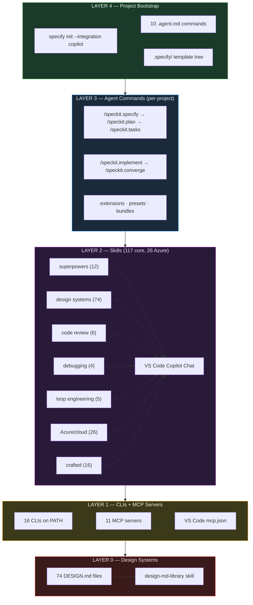

# 🧊 CubeCloud Skills Bundle

> One-command setup for a full **VS Code Copilot Chat** agent-skills stack on Windows — 191 skills, 18 CLIs, 11 MCP servers, and a 74-site design-system library, all security-gated.

[](#whats-included)
[](#clis-installed)
[](#mcp-servers)
[](#security-model)
[](#prerequisites)
[](#changelog)
[](LICENSE)

---

## Why this exists

VS Code Copilot Chat gets dramatically more powerful when you give it **skills** — markdown instruction packs that teach it domain-specific workflows (TDD, systematic debugging, design systems, Azure patterns, PR review). But assembling a trustworthy stack by hand is painful: you have to find skills, vet them for safety, wire up the MCP servers, install the CLIs, and repeat on every machine.

**CubeCloud Skills Bundle** does all of it in one command. Every skill passes through [NVIDIA SkillSpector](https://github.com/NVIDIA/skillspector) before landing on your machine — vulnerable skills are blocked by design, not after the fact.

## What you get

|                    | Count   | What                                                                                                                                                                                                                                                                                                                                                                                            |
| ------------------ | ------- | ----------------------------------------------------------------------------------------------------------------------------------------------------------------------------------------------------------------------------------------------------------------------------------------------------------------------------------------------------------------------------------------------- |
| 🧠 Skills          | **191** | Discovered by Copilot Chat — superpowers methodology, ui-skills, agent-skills, ECC agent engineering, Azure patterns, design systems, code review, debugging, archify diagrams, huashu-design, and more                                                                                                                                                                                         |
| 🔧 CLIs            | **18**  | On PATH: `skillspector`, `skills-ref`, `specify`, `agent-reach`, `graphify`, `markitdown`, `gbrain`, `scrapling`, `uipro`, `firecrawl`, `skillopt-eval`, `headroom`, `loop`, `watch-skill`, `wigolo`, `ocr`, `semantica`, `witr`                                                                                                                                                                |
| 🔌 MCP servers     | **11**  | Configured in VS Code `mcp.json`: markitdown, skillspector, firecrawl, scrapling, gbrain, graphify, headroom, loop-engineering, watch-skill, wigolo, skillopt                                                                                                                                                                                                                                   |
| 📚 Fork mirrors    | **39**  | Read-only backups in `~/dev/forks/JZKK720/`, including VoltAgent/awesome-design-md, microsoft/SkillOpt, alibaba/open-code-review, EveryInc/compound-engineering-plugin, Shubhamsaboo/awesome-llm-apps, cobusgreyling/loop-engineering, oxbshw/watch-skill, KnockOutEZ/wigolo, tt-a1i/archify, virgiliojr94/book-to-skill, alchaincyf/huashu-design, semantica-agi/semantica, pranshuparmar/witr |
| 🎨 DESIGN.md files | **74**  | Real-world design systems (Apple, Stripe, Linear, Vercel, Notion, Airbnb, Tesla…) indexed by the `design-md-library` skill                                                                                                                                                                                                                                                                      |
| 🔒 Security-gated  | **yes** | Every skill scanned by SkillSpector before install; 5 skills blocked by design                                                                                                                                                                                                                                                                                                                  |

## Architecture



> **Layer 4** is where [spec-kit](https://github.com/github/spec-kit) lives — the only component that bridges "new project idea" → "structured, agent-ready project." Without it, every project starts as a blank prompt. With `specify init`, Copilot gets 10 native workflow commands, an SDD template stack, and an extension ecosystem.

## Quick start

```powershell
git clone https://github.com/JZKK720/cubecloud-skilldbundle-setup.git ~/dev/setup
powershell -NoProfile -ExecutionPolicy Bypass -File ~/dev/setup/setup-global-skills.ps1
```

Then **restart VS Code**, open Copilot Chat, and type `#` to see your MCP tools appear.

**Total time: ~15 minutes** (or ~10 min with `-SkipForks`).

### Prerequisites

The script checks for and (where possible) installs these. Pre-install on a fresh machine:

```powershell
winget install Python.Python.3.12
winget install Python.Python.3.13
winget install OpenJS.NodeJS
winget install Git.Git
winget install Microsoft.VisualStudioCode
```

`Python 3.12` is used for guarded `headroom-ai` installs to avoid the unstable 3.13 build path.

## What's included

### Skills (191 in manifest — 18 blocked by the gate, 1 disabled)

**Superpowers methodology (12 skills)** from [obra/superpowers](https://github.com/obra/superpowers):
test-driven-development · systematic-debugging · writing-plans · executing-plans · subagent-driven-development · requesting-code-review · receiving-code-review · using-git-worktrees · finishing-a-development-branch · writing-skills · using-superpowers · dispatching-parallel-agents

**ECC agent engineering (35 skills)** from [evan-ai/ECC](https://github.com/evan-ai/ECC) — curated from 278, framework-agnostic only:
safety-guard · token-budget-advisor · intent-driven-development · verification-loop · eval-harness · agent-self-evaluation · prompt-optimizer · rules-distill · knowledge-ops · codebase-onboarding · repo-scan · code-tour · search-first · blueprint · strategic-compact · enterprise-agent-ops · production-audit · error-handling · delivery-gate · coding-standards · context-budget · security-review · security-scan · security-bounty-hunter · brand-discovery · brand-voice · frontend-design-direction · make-interfaces-feel-better · continuous-agent-loop · cost-tracking · cost-aware-llm-pipeline · automation-audit-ops · connections-optimizer · mcp-server-patterns · backend-patterns

**oz-skills (14 active)** from the JZKK720 fork mirror:
analysis-artifacts · ci-fix · create-pull-request · dbt-model-index · docs-update · github-bug-report-triage · github-issue-dedupe · mcp-builder · scheduler · seo-aeo-audit · slack-qa-investigate · terraform-style-check · web-accessibility-audit · web-performance-audit

**ui-skills (7 active)** from [ibelick/ui-skills](https://github.com/ibelick/ui-skills):
ui-skills-root · baseline-ui · create-design-md · fixing-accessibility · fixing-metadata · fixing-motion-performance · improve-ui

**agent-skills (23 active, unique entries)** from [addyosmani/agent-skills](https://github.com/addyosmani/agent-skills):
api-and-interface-design · browser-testing-with-devtools · ci-cd-and-automation · code-review-and-quality · code-simplification · context-engineering · debugging-and-error-recovery · deprecation-and-migration · documentation-and-adrs · doubt-driven-development · frontend-ui-engineering · git-workflow-and-versioning · idea-refine · incremental-implementation · interview-me · observability-and-instrumentation · performance-optimization · planning-and-task-breakdown · security-and-hardening · shipping-and-launch · source-driven-development · spec-driven-development · using-agent-skills

**Azure & cloud (27 skills)** — bundled with VS Code Azure extensions, discovered automatically:
ai-mlstudio · airunway-aks-setup · appinsights-instrumentation · azure-ai · azure-aigateway · azure-cloud-migrate · azure-compliance · azure-compute · azure-cost · azure-deploy · azure-diagnostics · azure-enterprise-infra-planner · azure-kubernetes · azure-kusto · azure-messaging · azure-prepare · azure-quotas · azure-reliability · azure-resource-lookup · azure-resource-visualizer · azure-storage · azure-upgrade · azure-validate · entra-agent-id · entra-app-registration · microsoft-foundry · python-appservice-deploy

These Azure/Foundry entries are standard extension-provided skills, not custom bundle ports.

**Crafted individual skills:**

- **self-learning** — capture hard-won workflows as reusable skills
- **improve** — audit a codebase into prioritized implementation plans
- **loopy** — discover, run, and publish repeatable agent loops
- **loop-engineering** — design, scaffold, audit, and operate agent loop infrastructure (scheduling, isolation, scoring, governance). Complements loopy (loop content) with loop infrastructure.
- **watch-skill** — video intelligence for agents: watch, remember, verify. 23 MCP tools for video analysis, transcription, OCR, and THE LOOP (browser/UI verification).
- **wigolo** — local-first web intelligence: search, fetch, crawl, extract, research. 10 MCP tools, no API keys needed for core tools. Complements firecrawl (paid) with a free local alternative.
- **ponytail** — force the laziest solution that actually works (YAGNI)
- **hallmark** — anti-slop UI design for landing pages and redesigns
- **taste-skill** — frontend taste/polish, anti-templated output
- **karpathy-guidelines** — coding behavioral guidelines
- **agent-reach** — research across 15 platforms (Twitter, Reddit, YouTube, GitHub, LinkedIn, Xueqiu, Bilibili, XiaoHongShu, and more)
- **graphify** — turn any folder into a knowledge graph
- **browser-harness** — full CDP browser automation (navigate, extract, interact)
- **loop-engineering (5 skills)** — agent self-management: triage, constraints, budget, verification, minimal-fix
- **ARIS ports (3 skills)** — academic research workflow: literature search, novelty check, idea generation
- **changelog-generator** — auto-generate user-facing changelogs from git history

Custom implementations maintained in this setup are `agent-reach` and `gstack-review`.

**Hand-ported:**

- **gstack-review** — pre-landing PR review with structural-issue checklist + 8 specialist lenses (security, testing, maintainability, performance, data-migration, api-contract, red-team). Adapted from [garrytan/gstack](https://github.com/garrytan/gstack) (MIT).
- **design-md-library** — indexes the 74 DESIGN.md files in the awesome-design-md fork mirror so agents can self-serve "make it look like Stripe" requests
- **idea-to-design** — clean port of obra/superpowers `brainstorming` (upstream blocked by SkillSpector for tool parameter abuse in `stop-server.sh`). Methodology only: collaborative design dialogue, hard gate before implementation, spec self-review, user review gate. No browser server, no scripts.
- **webapp-testing** — clean port of JZKK720/oz-skills `webapp-testing` (upstream blocked by SkillSpector for `shell=True` tool parameter abuse in `scripts/with_server.py`). Methodology only: reconnaissance-then-action pattern, static vs dynamic decision tree. No bundled scripts; agent writes native Playwright or uses browser MCP tools.

**Disabled by default:**

- **caveman** — token compression, opt-in only

**Blocked by SkillSpector (not installed — by design):**

| Skill                      | Reason                                                                        | Clean port?                             |
| -------------------------- | ----------------------------------------------------------------------------- | --------------------------------------- |
| brainstorming              | Tool parameter abuse in `stop-server.sh`                                      | **Yes** → `idea-to-design`              |
| last30days                 | Info stealer (reads browser cookies)                                          | No — use `agent-reach`                  |
| ui-ux-pro-max              | Prompt extraction + unsafe defaults                                           | No — use `hallmark` + `taste-skill`     |
| anysearch                  | Vulnerable `requests==2.20` (8 CVEs)                                          | No                                      |
| webapp-testing (oz-skills) | HIGH TM1 — tool parameter abuse (`shell=True` in `scripts/with_server.py:69`) | **Yes** → `webapp-testing` (clean port) |

These manifest entries are advertised by the install manifest but **blocked by the
SkillSpector hard gate** at install time (verified 2026-09-13). They are not a defect —
the gate is doing its job. The 9 `ce-*` entries and the 2 `taste-*` entries below have been
**pruned from the manifest** so `install-missing-skills.ps1` no longer retries them on every
run; they are listed here so the gate result stays visible.

| Skill(s)                                                                        | Source repo                            | Blocked by                                                       |
| ------------------------------------------------------------------------------- | -------------------------------------- | ---------------------------------------------------------------- |
| `ce-brainstorm`, `ce-plan`, `ce-work`                                           | EveryInc/compound-engineering-plugin   | MEDIUM `RA2` — session persistence                               |
| `ce-compound`                                                                   | EveryInc/compound-engineering-plugin   | HIGH `E4` context leakage + HIGH `RA1` self-modification         |
| `ce-sweep`                                                                      | EveryInc/compound-engineering-plugin   | HIGH `P2` — hidden instructions                                  |
| `ce-pov`                                                                        | EveryInc/compound-engineering-plugin   | HIGH `TM2` — chaining abuse                                      |
| `ce-optimize`                                                                   | EveryInc/compound-engineering-plugin   | HIGH `TM1` — tool parameter abuse                                |
| `ce-doc-review`                                                                 | EveryInc/compound-engineering-plugin   | HIGH `TM2` — chaining abuse                                      |
| `ce-babysit-pr`                                                                 | EveryInc/compound-engineering-plugin   | HIGH `YR1` — YARA *destructive autonomous actions*               |
| `commit-archaeologist`, `scope-creep-detector`                                  | Shubhamsaboo/awesome-llm-apps          | MEDIUM `RP1` unpinned MCP + HIGH `OH1` unvalidated output inject |
| `archify`                                                                       | tt-a1i/archify                         | HIGH `YR4` — YARA *agent_skill_mcp_tool_poisoning_metadata*      |
| `huashu-design`                                                                 | alchaincyf/huashu-design               | HIGH `SC4` — vulnerable dependency `sharp==0.34.5` (2 advisories) |
| `taste-application`                                                             | JZKK720/ECC                            | CRITICAL `SC4` numpy/Pillow/setuptools (10 advisories each) + HIGH `AR2` anti-refusal + HIGH `E2` env harvesting + HIGH `OH1` |
| `taste-distillation`                                                            | JZKK720/ECC                            | CRITICAL + MEDIUM `AST4` subprocess calls + MEDIUM `AST3` dynamic import |

### Curated out by scope (not blocked — deliberately excluded)

These pass the gate but are excluded by the same curation rule the ECC block already
applies ("framework-agnostic only; framework-specific, ECC-internal, and domain-niche
excluded"). Excluding them keeps the bundle coherent.

| Skill(s)                                                                        | Reason                                                                |
| ------------------------------------------------------------------------------- | --------------------------------------------------------------------- |
| `rails-patterns` (ECC)                                                          | Ruby on Rails 7.1+/8.x framework patterns — no other Rails content    |
| `master-agreement-generator`, `esign-field-placement` (ECC)                     | Domain-niche legal (contract drafting, e-signature field placement)   |
| `tasteforge-video` (ECC)                                                        | Orchestrator over the taste video stack, whose siblings are blocked   |
| `Gskills` (google/skills, 137 skills — mirror only)                             | 118/137 are GCP `cloud` (GKE, BigQuery, AlloyDB, IAM, Cloud Run); this is a Windows/Copilot/Azure kit |

### CLIs installed

| Tool            | Source | Purpose                                                                                                                                                                                                                                                                                                |
| --------------- | ------ | ------------------------------------------------------------------------------------------------------------------------------------------------------------------------------------------------------------------------------------------------------------------------------------------------------ |
| `skillspector`  | uv     | Security scanner — hard gate for every skill install                                                                                                                                                                                                                                                   |
| `skills-ref`    | uv     | Spec validator (advisory)                                                                                                                                                                                                                                                                              |
| `specify`       | uv     | Spec-Driven Development CLI — `specify init` bootstraps a project with 10 Copilot-native `.agent.md` workflow commands (specify → plan → tasks → implement → converge), a 4-layer template resolution stack, and community extensions/presets/bundles. Pairs with the `spec-driven-development` skill. |
| `skillopt-eval` | uv     | Skill evaluation harness                                                                                                                                                                                                                                                                               |
| `agent-reach`   | uv     | 15-platform research access                                                                                                                                                                                                                                                                            |
| `graphify`      | uv     | Folder → knowledge graph                                                                                                                                                                                                                                                                               |
| `markitdown`    | uv     | Convert anything to Markdown                                                                                                                                                                                                                                                                           |
| `scrapling`     | uv     | Stealthy web scraping                                                                                                                                                                                                                                                                                  |
| `semantica`     | uv     | Python knowledge-graph library with 17 plugin skills (v0.6.0). Requires Python 3.10+.                                                                                                                                                                                                                  |
| `uipro`         | npm    | UI/UX workflow CLI                                                                                                                                                                                                                                                                                     |
| `firecrawl`     | npm    | Firecrawl API CLI                                                                                                                                                                                                                                                                                      |
| `gbrain`        | bun    | Persistent agent memory                                                                                                                                                                                                                                                                                |
| `headroom`      | uv     | Context compression layer for AI agents (60-95% fewer tokens); MCP server exposes `headroom_compress`, `headroom_retrieve`, `headroom_stats`. Requires Defender exclusion for `ast-grep-cli` — see [Platform limitations](#platform-limitations-windows).                                              |
| `loop`          | npm    | Loop engineering CLI front door — `npx @cobusgreyling/loop init`, `doctor`, `status`, `audit`, `cost`. Scaffolds agent loops (daily triage, PR babysitter, CI sweeper, etc.) with Loop Ready scoring.                                                                                                  |
| `watch-skill`   | uv     | Video intelligence CLI — `watch-skill watch`, `ask`, `search`, `serve`. 23 MCP tools for video analysis, transcription, OCR, and THE LOOP verification.                                                                                                                                                |
| `wigolo`        | npm    | Local-first web intelligence — `npx wigolo`. 10 MCP tools for search, fetch, crawl, extract, research. No API keys needed for core tools.                                                                                                                                                              |
| `ocr`           | npm    | AI-powered code review CLI — `ocr review`, `scan`, `delegate`. Deterministic + agent hybrid architecture (alibaba/open-code-review, Apache-2.0). Battle-tested at Alibaba's scale.                                                                                                                     |
| `witr`          | binary | "Why is this running?" — Go process ancestry investigator (v0.3.3). Installed from GitHub releases (no Go toolchain needed).                                                                                                                                                                           |

### MCP servers

Configured in VS Code User `mcp.json`:

- **markitdown** — convert anything to Markdown
- **skillspector** — skill security scanning
- **firecrawl** — web scraping/crawling
- **scrapling** — stealthy fetching
- **gbrain** — persistent memory
- **graphify** — codebase knowledge graphs
- **headroom** — context compression (`headroom_compress`, `headroom_retrieve`, `headroom_stats`)
- **loop-engineering** — loop pattern lookup, skills, state (`@cobusgreyling/loop-mcp-server`)
- **watch-skill** — video analysis, transcription, OCR, THE LOOP verification (`watch-skill serve`)
- **wigolo** — local-first web search, fetch, crawl, research (`npx wigolo`)
- **skillopt** — SkillOpt research engine: validation-gated skill optimization via MCP tools `skillopt_list_configs`, `skillopt_train`, `skillopt_eval` (microsoft/SkillOpt, MIT). Shells out to the repo's `scripts/train.py` / `eval_only.py` — requires the SkillOpt fork mirror.

### OpenCodeReview (AI code review)

The bundle includes the **`ocr` CLI** (`@alibaba-group/open-code-review`, Apache-2.0) — a deterministic + agent hybrid code review engine battle-tested at Alibaba's scale. Two skills ship with it:

- **`open-code-review`** — invokes `ocr review` with the right flags, prerequisite checks, and a comment-triage rubric (High/Medium/Low). Requires a configured LLM.
- **`open-code-review-delegate`** — delegation mode: the host agent drives the review using its own LLM; OCR handles only deterministic file selection and rule resolution. **No OCR-side LLM needed.**

```powershell
ocr review --audience agent -b "context"           # review working copy
ocr review --audience agent -b "context" --from main --to feature  # branch range
ocr review --preview                                # dry-run (no LLM cost)
ocr delegate preview                                # delegation mode preview
```

### SkillOpt-Sleep (nightly self-evolution)

The setup also schedules **SkillOpt-Sleep** — a nightly offline cycle that harvests past session transcripts, mines recurring tasks, replays them, and stages a validated skill edit for review (adopt is manual by design). Installed as a Windows Scheduled Task (`schtasks`) at 03:17 daily via `skillopt-sleep schedule --project ~/dev --backend mock`. The `mock` backend spends no model budget; re-schedule with `--backend claude` or `--backend copilot` once credentials are configured:

```powershell
skillopt-sleep status      # show state + latest staged proposal
skillopt-sleep adopt       # apply the latest staged proposal (with backup)
skillopt-sleep unschedule --all   # remove the nightly task
skillopt-sleep schedule --project ~/dev --backend claude --hour 3 --minute 17
```

Logs land in `~/dev/.skillopt-sleep/cron.log`. Sleep only STAGES proposals — no skill changes until you run `adopt`.

## Security model

Every skill is scanned by **NVIDIA SkillSpector** before install:

```powershell
skillspector scan --no-llm <dir>
```

- Exit 0 → safe → install proceeds
- Exit 1 → `do_not_install` → **HARD BLOCK**, skill is not installed
- Exit 2 → error → investigate before retrying

`skills-ref validate` runs as an **advisory** check (logs spec drift, doesn't block).

Full verdict history is in [`upstream/SCAN_LOG.md`](upstream/SCAN_LOG.md).

## Repository layout

```
~/dev/
├── setup/                      # the one-command installer + config
│   ├── setup-global-skills.ps1 # master installer
│   ├── install-skill.ps1       # security-gated skill install helper
│   ├── skills-list.csv         # manifest of 154 entries (153 active + 1 disabled)
│   ├── mcp.json.template       # 11 MCP server config
│   └── SETUP_GUIDE.md          # detailed guide
├── bin/                        # 17 audit/fix/install helper scripts
├── upstream/                   # governance docs + design-md-library wrapper skill
└── forks/JZKK720/              # 39 read-only fork mirrors (gitignored, re-cloned)
```

## How to use after setup

In Copilot Chat, try:

- _"use the **improve** skill to audit this codebase"_
- _"use **systematic-debugging** to investigate this error"_
- _"use the **design-md-library** to build me a page that looks like Stripe"_
- _"use **gstack-review** to review my PR"_
- _"use **agent-reach** to research what people are saying about X on Reddit"_
- _"use `specify init my-app --integration copilot` to scaffold a new SDD project"_
- _"then `/speckit.specify Build a photo organizer with album grouping and drag-and-drop`"_
- _"use **loop-engineering** to set up automated daily triage on this repo"_
- _"use **watch-skill** to analyze this meeting recording"_
- _"use **wigolo** to research what's new in React 19"_

## To update later

```powershell
# Standard safe update pass (guarded headroom update + skills-ref repair + gbrain update + smoke)
powershell -NoProfile -ExecutionPolicy Bypass -File .\bin\safe-update-pass.ps1

# Or re-run the installer (skips already-installed items)
powershell -NoProfile -ExecutionPolicy Bypass -File ~/dev/setup/setup-global-skills.ps1

# Manual fallback (if you need step-by-step control)
uv tool upgrade --all
npm update -g
bun install -g github:garrytan/gbrain

# Re-scan all skills quarterly
skillspector scan ~/.agents/skills/ --recursive --no-llm
```

## To add a new skill

```powershell
cd ~/dev/bin
.\install-skill.ps1 -Repo "owner/repo" -Name "skill-name"
# Disabled:
.\install-skill.ps1 -Repo "owner/repo" -Name "skill-name" -Disabled
# Custom path:
.\install-skill.ps1 -Repo "owner/repo" -Name "skill-name" -SkillRelPath "path/to/skill"
```

## Platform limitations (Windows)

| Tool     | Issue                                                                      | Workaround                                                                                                                                                  |
| -------- | -------------------------------------------------------------------------- | ----------------------------------------------------------------------------------------------------------------------------------------------------------- |
| EverOS   | `import fcntl` (Unix-only)                                                 | Not installed. `gbrain` MCP used instead.                                                                                                                   |
| headroom | Windows Defender blocks `ast-grep-cli.exe` (false positive on Rust binary) | Run `bin/add-defender-exclusion-ast-grep.ps1` in an elevated PowerShell, then `uv tool install "headroom-ai[proxy]"`. Exclusion is scoped to ast-grep only. |
| recall   | Needs Claude Code hooks                                                    | Claude Code only; not for VS Code Copilot.                                                                                                                  |

## Changelog

### v1.6.3 (2026-09-13)

**Upstream follow-through: renames, additions, and two more stale fork mirrors repaired.**

**191 skills in manifest · 18 CLIs · 11 MCP servers · 39 fork mirrors · 236 active total**

- **Fixed: `crucible` was renamed upstream.** Commit `a027430` rebranded `skills/crucible` → `skills/claudex-loop` and added `skills/claudex-route`, so the old manifest entry 404'd. `claudex-loop` keeps the legacy `/crucible` trigger and generalises it to bidirectional Claude/Codex work. Both installed; the retired entry is parked as a comment.
- **Fixed: two stale JZKK720 fork mirrors.** `crucible` (12 commits) and `ECC` (277 commits) were behind upstream on GitHub while the local clones were current, so installs failed with "SKILL.md not found" because the installer clones from `JZKK720/...`. Both were clean fast-forwards and were pushed.
- **Fixed: `gstack-review` was in the wrong place and missing its references.** It lived only in `~/.copilot/skills/` as a bare `SKILL.md`, without the `reference/` tree the manifest documents. Rebuilt in `~/.agents/skills/` with all 12 reference files (checklist, design-checklist, TODOS-format, greptile-triage, and the 8 `specialists/` lenses), and `SKILL.md` gained a section 7 mapping each review layer to its file so the copied docs are actually discoverable. Stale duplicate removed.
- **Fixed: two empty fork mirrors.** `ui-skills` and `loop-engineering` were 0-byte placeholder directories. Both cloned for real (230 and 731 files) and added to `sync-fork-upstreams.ps1` so they stay tracked.
- **Added:** `constraint-driven-development` (addyosmani/agent-skills) — writes a project's quality bar into `CONSTRAINTS.md` and catches a weakened bar in the diff; `budget-negotiator` and `install-loop` (cobusgreyling/loop-engineering) — completing the loop family at 7/7; `counterparty-channel-discipline` and `operator-approval-loop` (ECC) — mention gating, silent observation, hashed draft approvals and a pre-draft baseline gate for agents talking to external counterparties.
- **Pruned:** 11 gate-blocked entries (`ce-*` ×9, `taste-*` ×2) moved from active manifest rows to comments, so the installer stops retrying them.
- **Documented:** a new "curated out by scope" table covering `rails-patterns`, the two ECC legal skills, `tasteforge-video`, and the 137-skill `Gskills` mirror (118 GCP-specific, mirror-only by decision).
- **Counters corrected:** 194 → 191 manifest entries; `~/.agents/skills/` 228 → 236 directories.

### v1.6.2 (2026-09-13)

**Verification pass + pipeline repair.** Counters corrected against measured reality, and four real defects in the install/update tooling fixed.

**194 skills in manifest · 18 CLIs · 11 MCP servers · 39 fork mirrors · 228 active total**

- **Fixed: `install-skill.ps1` was corrupt.** The deployed `~/dev/bin/install-skill.ps1` had stray prose prepended above its block comment, producing 12 parse errors. Every install silently failed and `install-missing-skills.ps1` reported `Installed: 0` without erroring. Redeployed from `setup/install-skill.ps1`; all three copies now hash identically.
- **Fixed: `sync-fork-upstreams.ps1` had 4 bugs.** (1) crashed on non-git mapped directories, aborting the whole run; (2) a `$LASTEXITCODE` leak forced the wrong branch, breaking `context-engineering-kit`; (3) git progress on stderr was promoted to a terminating error, producing false `FAILED` reports for successful fast-forwards; (4) five repos were missing from `$upstreamMap` and were silently skipped forever. 16 mirrors fast-forwarded as a result.
- **Fixed: portability.** 26 hardcoded `C:\Users\<dev>\...` paths across 9 scripts replaced with `$env:USERPROFILE` / `$env:APPDATA` / `$env:TEMP` equivalents; same for `mcp.json.template`.
- **Fixed: manifest paths.** `huashu-design` (SKILL.md is at repo root, needs `SkillRelPath="."`) and `archify` (needs `archify/archify`) had empty `SkillRelPath`, so their installs could not locate `SKILL.md`.
- **Fixed: MCP config.** The `skillopt` server pointed at a non-existent path in both the template and the live `mcp.json`. `loop-engineering` shipped in the template but never reached the live config. `SkillOpt` fork mirror restored; both entries now resolve. Live MCP servers 21 → 22.
- **Restored:** `agent-reach` and `semantica` were advertised as installed CLIs but were absent from PATH. Both reinstalled.
- **Documented:** the 13 manifest entries blocked by the SkillSpector hard gate, with per-skill reason (see table above).
- **Counters corrected:** README claimed 153 skills / 173 active total; measured reality is 194 manifest entries with 228 directories in `~/.agents/skills/`.
### v1.6.1 (2026-08-18)

**2 new skills (clean ports)**: `evidence-graph-review` (methodology extraction from reverse-skill, MIT), `ops-authorization-methodology` (auth/scope check for security tasks, MIT) — both clean methodology-only ports, no scripts, no toolchain coupling.

**155 skills · 18 CLIs · 11 MCP servers · 39 fork mirrors · 173 active total**

- **evidence-graph-review**: Evidence Graph Review — audit evidence-to-finding-to-path traceability, confidence grading, scope gating, and stop/replan conditions when authorization or evidence quality is insufficient. Methodology-only; no scripts, no tool execution.
- **ops-authorization-methodology**: Ops Authorization Methodology — confirm scope.md, network_profile mode, in-scope/out-of-scope assets, deliverables, and stop/replan conditions. No scripts, no toolchain coupling.

### v1.6.0 (2026-08-13)

**153 skills · 18 CLIs · 11 MCP servers · 39 fork mirrors · 172 active total**

- **+3 skills (clean ports)**: `anti-slop` (miqdadbadjuber/anti-slop, MIT), `diagram-design` (cathrynlavery/diagram-design, MIT), `book-to-skill` (virgiliojr94/book-to-skill, MIT)
  - `book-to-skill` and `diagram-design` upstreams were blocked by SkillSpector (CRITICAL/HIGH — bundled Python scripts + HTML assets); re-authored as clean methodology-only `local/*` ports using `markitdown` for extraction
- **Fix**: Phase 4 local/\* handling now reads the 5th CSV column (`upstream/<name>`) for source paths, matching `install-missing-skills.ps1`

### v1.5.0 (2026-08-11)

**144 skills · 18 CLIs · 11 MCP servers · 39 fork mirrors · 172 active total**

- **+5 skills**: archify, book-to-skill, huashu-design, scope-creep-detector, dependency-doctor, project-graveyard (awesome-llm-apps set)
- **+2 CLIs**: `semantica` (uv tool, v0.6.0), `witr` (GitHub release binary, v0.3.3 — no Go needed)
- **+3 fork mirrors**: alchaincyf/huashu-design, semantica-agi/semantica, pranshuparmar/witr
- **Phase 2**: automatic `witr` release-binary download added (no Go toolchain required)
- **Bug fixes**: removed 4 dead `local/*` placeholder entries from skills-list.csv; fixed local/\* handling in Phase 4
- **25 compound-engineering skills** integrated (blocked by SkillSpector risk 81/100 — available as fork mirror)

### v1.4.0 (2026-07-15)

**139 skills · 16 CLIs · 10 MCP servers · 36 fork mirrors**

- +35 ECC skills (agent engineering, codebase intelligence, development governance, security, design/UI, operations/cost, engineering practices)

### v1.3.0 and earlier

See `git tag --list` for older releases.

## License
