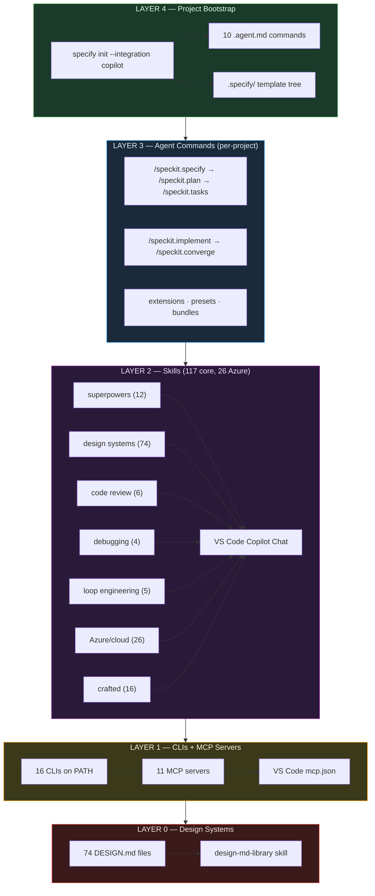

# 🧊 CubeCloud Skills Bundle

> One-command setup for a full **VS Code Copilot Chat** agent-skills stack on Windows — 254 skills, 18 CLIs, 11 MCP servers, and a 74-site design-system library, all security-gated.

[](#whats-included)
[](#clis-installed)
[](#mcp-servers)
[](#security-model)
[](#prerequisites)
[](#changelog)
[](LICENSE)

---

## Why this exists

VS Code Copilot Chat gets dramatically more powerful when you give it **skills** — markdown instruction packs that teach it domain-specific workflows (TDD, systematic debugging, design systems, Azure patterns, PR review). But assembling a trustworthy stack by hand is painful: you have to find skills, vet them for safety, wire up the MCP servers, install the CLIs, and repeat on every machine.

**CubeCloud Skills Bundle** does all of it in one command. Every skill passes through [NVIDIA SkillSpector](https://github.com/NVIDIA/skillspector) before landing on your machine — vulnerable skills are blocked by design, not after the fact.

## What you get

|                    | Count   | What                                                                                                                                                                                                                                                                                                                                                                                            |
| ------------------ | ------- | ----------------------------------------------------------------------------------------------------------------------------------------------------------------------------------------------------------------------------------------------------------------------------------------------------------------------------------------------------------------------------------------------- |
| 🧠 Skills          | **254** | Discovered by Copilot Chat — superpowers methodology, ui-skills, agent-skills, ECC agent engineering, Azure patterns, design systems, code review, debugging, archify diagrams, huashu-design, jev typed-decision skills, and the impeccable design-methodology series |
| 🔧 CLIs            | **18**  | On PATH: `skillspector`, `skills-ref`, `specify`, `agent-reach`, `graphify`, `markitdown`, `gbrain`, `scrapling`, `uipro`, `firecrawl`, `skillopt-eval`, `headroom`, `loop`, `watch-skill`, `wigolo`, `ocr`, `semantica`, `witr`                                                                                                                                                                |
| 🔌 MCP servers     | **11**  | Configured in VS Code `mcp.json`: markitdown, skillspector, firecrawl, scrapling, gbrain, graphify, headroom, loop-engineering, watch-skill, wigolo, skillopt                                                                                                                                                                                                                                   |
| 📚 Fork mirrors    | **50**  | Read-only backups in `~/dev/forks/JZKK720/`, including VoltAgent/awesome-design-md, microsoft/SkillOpt, alibaba/open-code-review, EveryInc/compound-engineering-plugin, Shubhamsaboo/awesome-llm-apps, cobusgreyling/loop-engineering, oxbshw/watch-skill, KnockOutEZ/wigolo, tt-a1i/archify, virgiliojr94/book-to-skill, alchaincyf/huashu-design, openai/skills, tech-leads-club/agent-skills, coreyhaines31/marketingskills, humanlayer/skills, kunchenguid/firstmate, blader/humanizer, petergyang/no-ai-slop, cathrynlavery/diagram-design, pbakaus/impeccable, wuyoscar/jev-skill |
| 🎨 DESIGN.md files | **74**  | Real-world design systems (Apple, Stripe, Linear, Vercel, Notion, Airbnb, Tesla…) indexed by the `design-md-library` skill                                                                                                                                                                                                                                                                      |
| 🔒 Security-gated  | **yes** | Every skill scanned by SkillSpector before install; blocked upstreams are either ported clean or parked as comments with a per-skill reason code (see the blocked-skills table)                                                                                                                                                                                                                                                                                                                  |

## Architecture



> **Layer 4** is where [spec-kit](https://github.com/github/spec-kit) lives — the only component that bridges "new project idea" → "structured, agent-ready project." Without it, every project starts as a blank prompt. With `specify init`, Copilot gets 10 native workflow commands, an SDD template stack, and an extension ecosystem.

## Quick start

```powershell
git clone https://github.com/JZKK720/cubecloud-skills-bundle-kit.git ~/dev/setup
powershell -NoProfile -ExecutionPolicy Bypass -File ~/dev/setup/setup-global-skills.ps1
```

Then **restart VS Code**, open Copilot Chat, and type `#` to see your MCP tools appear.

**Total time: ~15 minutes** (or ~10 min with `-SkipForks`).

### Prerequisites

The script checks for and (where possible) installs these. Pre-install on a fresh machine:

```powershell
winget install Python.Python.3.12
winget install Python.Python.3.13
winget install OpenJS.NodeJS
winget install Git.Git
winget install Microsoft.VisualStudioCode
```

`Python 3.12` is used for guarded `headroom-ai` installs to avoid the unstable 3.13 build path.

## What's included

### Skills (254 in manifest — 1 disabled, 19 gate-blocked entries parked as comments)

**Superpowers methodology (12 skills)** from [obra/superpowers](https://github.com/obra/superpowers):
test-driven-development · systematic-debugging · writing-plans · executing-plans · subagent-driven-development · requesting-code-review · receiving-code-review · using-git-worktrees · finishing-a-development-branch · writing-skills · using-superpowers · dispatching-parallel-agents

**ECC agent engineering (35 skills)** from [evan-ai/ECC](https://github.com/evan-ai/ECC) — curated from 278, framework-agnostic only:
safety-guard · token-budget-advisor · intent-driven-development · verification-loop · eval-harness · agent-self-evaluation · prompt-optimizer · rules-distill · knowledge-ops · codebase-onboarding · repo-scan · code-tour · search-first · blueprint · strategic-compact · enterprise-agent-ops · production-audit · error-handling · delivery-gate · coding-standards · context-budget · security-review · security-scan · security-bounty-hunter · brand-discovery · brand-voice · frontend-design-direction · make-interfaces-feel-better · continuous-agent-loop · cost-tracking · cost-aware-llm-pipeline · automation-audit-ops · connections-optimizer · mcp-server-patterns · backend-patterns

**oz-skills (14 active)** from the JZKK720 fork mirror:
analysis-artifacts · ci-fix · create-pull-request · dbt-model-index · docs-update · github-bug-report-triage · github-issue-dedupe · mcp-builder · scheduler · seo-aeo-audit · slack-qa-investigate · terraform-style-check · web-accessibility-audit · web-performance-audit

**ui-skills (7 active)** from [ibelick/ui-skills](https://github.com/ibelick/ui-skills):
ui-skills-root · baseline-ui · create-design-md · fixing-accessibility · fixing-metadata · fixing-motion-performance · improve-ui

**agent-skills (23 active, unique entries)** from [addyosmani/agent-skills](https://github.com/addyosmani/agent-skills):
api-and-interface-design · browser-testing-with-devtools · ci-cd-and-automation · code-review-and-quality · code-simplification · context-engineering · debugging-and-error-recovery · deprecation-and-migration · documentation-and-adrs · doubt-driven-development · frontend-ui-engineering · git-workflow-and-versioning · idea-refine · incremental-implementation · interview-me · observability-and-instrumentation · performance-optimization · planning-and-task-breakdown · security-and-hardening · shipping-and-launch · source-driven-development · spec-driven-development · using-agent-skills

**Azure & cloud (27 skills)** — bundled with VS Code Azure extensions, discovered automatically:
ai-mlstudio · airunway-aks-setup · appinsights-instrumentation · azure-ai · azure-aigateway · azure-cloud-migrate · azure-compliance · azure-compute · azure-cost · azure-deploy · azure-diagnostics · azure-enterprise-infra-planner · azure-kubernetes · azure-kusto · azure-messaging · azure-prepare · azure-quotas · azure-reliability · azure-resource-lookup · azure-resource-visualizer · azure-storage · azure-upgrade · azure-validate · entra-agent-id · entra-app-registration · microsoft-foundry · python-appservice-deploy

These Azure/Foundry entries are standard extension-provided skills, not custom bundle ports.

**Crafted individual skills:**

- **self-learning** — capture hard-won workflows as reusable skills
- **improve** — audit a codebase into prioritized implementation plans
- **loopy** — discover, run, and publish repeatable agent loops
- **loop-engineering** — design, scaffold, audit, and operate agent loop infrastructure (scheduling, isolation, scoring, governance). Complements loopy (loop content) with loop infrastructure.
- **watch-skill** — video intelligence for agents: watch, remember, verify. 23 MCP tools for video analysis, transcription, OCR, and THE LOOP (browser/UI verification).
- **wigolo** — local-first web intelligence: search, fetch, crawl, extract, research. 10 MCP tools, no API keys needed for core tools. Complements firecrawl (paid) with a free local alternative.
- **ponytail** — force the laziest solution that actually works (YAGNI)
- **hallmark** — anti-slop UI design for landing pages and redesigns
- **taste-skill** — frontend taste/polish, anti-templated output
- **karpathy-guidelines** — coding behavioral guidelines
- **agent-reach** — research across 15 platforms (Twitter, Reddit, YouTube, GitHub, LinkedIn, Xueqiu, Bilibili, XiaoHongShu, and more)
- **graphify** — turn any folder into a knowledge graph
- **browser-harness** — full CDP browser automation (navigate, extract, interact)
- **loop-engineering (5 skills)** — agent self-management: triage, constraints, budget, verification, minimal-fix
- **ARIS ports (3 skills)** — academic research workflow: literature search, novelty check, idea generation
- **changelog-generator** — auto-generate user-facing changelogs from git history

Custom implementations maintained in this setup are `agent-reach` and `gstack-review`.

**Hand-ported:**

- **gstack-review** — pre-landing PR review with structural-issue checklist + 8 specialist lenses (security, testing, maintainability, performance, data-migration, api-contract, red-team). Adapted from [garrytan/gstack](https://github.com/garrytan/gstack) (MIT).
- **design-md-library** — indexes the 74 DESIGN.md files in the awesome-design-md fork mirror so agents can self-serve "make it look like Stripe" requests
- **idea-to-design** — clean port of obra/superpowers `brainstorming` (upstream blocked by SkillSpector for tool parameter abuse in `stop-server.sh`). Methodology only: collaborative design dialogue, hard gate before implementation, spec self-review, user review gate. No browser server, no scripts.
- **webapp-testing** — clean port of JZKK720/oz-skills `webapp-testing` (upstream blocked by SkillSpector for `shell=True` tool parameter abuse in `scripts/with_server.py`). Methodology only: reconnaissance-then-action pattern, static vs dynamic decision tree. No bundled scripts; agent writes native Playwright or uses browser MCP tools.
- **archify** — clean port of [tt-a1i/archify](https://github.com/tt-a1i/archify) (MIT, v2.17). Upstream is blocked by SkillSpector (`HIGH MP3`), so the port keeps the authoring contract, type router, invariant list, Mermaid conversion rules and the validate → deliver → visual-check sequence, and drops the renderer/schemas/examples. Gates 0/100 SAFE. **Methodology only** — the upstream CLI lives in the fork mirror; the SKILL.md says so explicitly rather than implying an unrun validation passed.

  **Optional: the `archify` CLI.** The renderer itself can also be exposed as a bare command:

  ```powershell
  powershell -NoProfile -ExecutionPolicy Bypass -File .\setup-global-skills.ps1 -IncludeArchifyCli
  ```

  This writes one 86-byte `~/.local/bin/archify.cmd` shim that forwards to the fork mirror's
  `bin/archify.mjs`. It is **opt-in** because every other phase of the installer is
  unconditional and this one adds a command to your PATH. `archify` is a **zero-runtime-dependency**
  Node CLI — `bin/archify.mjs` imports only `node:` stdlib, and the mirror has no `node_modules`
  and needs none — so the shim needs no package manager, no registry, and no global npm install.
  (An npm install is not even possible: upstream `package.json` sets `"private": true`.)
  It requires the `archify` fork mirror, so it is incompatible with `-SkipForks`; the installer
  warns and continues rather than failing. The installer runs `archify doctor` before writing the
  shim, so it will not advertise a command it has not verified.

  ```powershell
  archify doctor
  archify render architecture diagram.json out.html
  archify validate architecture diagram.json --quality showcase --json
  ```

**tech-leads-club/agent-skills (12 active)** from [tech-leads-club/agent-skills](https://github.com/tech-leads-club/agent-skills) (MIT):

- **Domain-driven design, installed as a set (6)** — `domain-analysis` · `domain-identification-grouping` · `coupling-analysis` · `decomposition-planning-roadmap` · `tactical-ddd` · `modular-design-principles`. These reference each other, so a partial subset would leave dangling references.
- **Planning and evaluation (6)** — `create-technical-design-doc` (1055 lines) · `create-rfc` · `harness-eval` · `spec-driven-eval` · `not-your-babysitter` · `learning-opportunities`

**marketingskills (8 active)** from [coreyhaines31/marketingskills](https://github.com/coreyhaines31/marketingskills) (MIT):
`product-marketing` · `copywriting` · `content-strategy` · `competitor-profiling` · `launch` · `pricing` · `marketing-loops` · `marketing-psychology`

General marketing discipline in, platform-specific execution out. The repo's `tools/` tree (60+ optional integration scripts) is deliberately not installed.

**openai/skills (5 active)** from [openai/skills](https://github.com/openai/skills) (**Apache-2.0 per skill**):
`figma` · `screenshot` · `pdf` · `transcribe` · `security-threat-model`

The repo root has no LICENSE, but every skill directory ships its own `LICENSE.txt` and the adopted set is Apache-2.0, matching the README. Provenance is recorded deliberately because the root looks ambiguous.

**firstmate (4 active)** from [kunchenguid/firstmate](https://github.com/kunchenguid/firstmate) (MIT):
`bearings` · `diagnostic-reasoning` · `bootstrap-diagnostics` · `project-management`

Four of 22 — the rest are bound to firstmate's own supervisor daemon and `bin/fm-*.sh` scripts, with one gate block (`stow`) and three high-severity findings.

**humanlayer/skills (3 active)** from [humanlayer/skills](https://github.com/humanlayer/skills) (MIT):
`show-me` · `improve-claude-md` · `narrow-react-prop-types`

**Prose de-slopping (2 active):**

- **humanizer** — [blader/humanizer](https://github.com/blader/humanizer) (MIT, 291 lines). Wikipedia's "Signs of AI writing": numbered tells ranked strongest-first with explicit weak-alone marking, plus voice preservation and a fiction exemption.
- **no-ai-slop** — [petergyang/no-ai-slop](https://github.com/petergyang/no-ai-slop) (MIT, 61 lines). Edit and detect modes, banned word list, pattern catalogue, `eval.md` self-check. Gates 0 findings at any severity.

Two independent implementations kept as complements. The bundle's `write-concisely` covers density and `brand-voice` covers deriving a voice from source material, but neither de-slopped *existing* prose.

**Disabled by default:**

- **caveman** — token compression, opt-in only

**Blocked by SkillSpector (not installed — by design):**

| Skill                      | Reason                                                                        | Clean port?                             |
| -------------------------- | ----------------------------------------------------------------------------- | --------------------------------------- |
| brainstorming              | Tool parameter abuse in `stop-server.sh`                                      | **Yes** → `idea-to-design`              |
| last30days                 | Info stealer (reads browser cookies)                                          | No — use `agent-reach`                  |
| ui-ux-pro-max              | Prompt extraction + unsafe defaults                                           | No — use `hallmark` + `taste-skill`     |
| anysearch                  | Vulnerable `requests==2.20` (8 CVEs)                                          | No                                      |
| webapp-testing (oz-skills) | HIGH TM1 — tool parameter abuse (`shell=True` in `scripts/with_server.py:69`) | **Yes** → `webapp-testing` (clean port) |
| archify (tt-a1i)           | HIGH MP3 — memory manipulation (re-classified from YR4)                       | **Yes** → `archify` (clean port)        |
| diagram-design (upstream)  | HIGH AR2 — anti-refusal statement                                             | **Yes** → `diagram-design` (port)       |
| jev (wuyoscar/jev-skill)   | HIGH E2 env-var harvesting in scripts/jev.py, plus the executable-scripts flag | **Yes** -> jev (prose-only port) |

**Added v1.8.0 — blocked or high-risk entries found in the 14-repo evaluation:**

| Skill(s)                        | Source repo                                | Blocked by                                                    |
| ------------------------------- | ------------------------------------------ | ------------------------------------------------------------- |
| `shopify-developer`             | tech-leads-club/agent-skills               | **CRITICAL** `YR1` — YARA credential-exfiltration webhook     |
| `security-ownership-map`        | openai/skills · tech-leads-club/agent-skills | HIGH `P6` — direct prompt extraction (blocked in both catalogs) |
| `figma-use`                     | openai/skills                              | HIGH `P6` — direct prompt extraction                          |
| `imagegen`, `skill-installer`   | openai/skills (`.system`)                  | HIGH `P6` / HIGH `E2` — prompt extraction, env harvesting     |
| `migrate-to-codex`              | openai/skills                              | BLOCK (Codex-specific anyway)                                 |
| `ad-creative`                   | coreyhaines31/marketingskills              | BLOCK                                                          |
| `stow`                          | kunchenguid/firstmate                      | HIGH `E4` — context leakage                                   |

Also skipped for HIGH findings even though the gate returned 0: `the-fool`, `the-jury`
(HIGH `AR2` anti-refusal), `mermaid-studio` (HIGH `PE3`), `codenavi` and
`react-composition-patterns` (HIGH `MP3`), `cloudflare-deploy` / `sentry` (HIGH `E2`),
`vercel-deploy` / `react-native-expert` (HIGH `PE3`), `core-web-vitals` / `seo` /
`web-best-practices` (HIGH `P2`), `security-best-practices` / `react-best-practices`
(HIGH `OH1`), `create-adr` / `tlc-spec-driven` / `figma-implement-design` (HIGH `E4`),
`speech` (HIGH `P6`), `jupyter-notebook` (HIGH `RA1`), `cli-creator` (HIGH `AS1`),
`sentry` (HIGH `SC2`), `marketing-plan` (HIGH `AR1`), `harness-adapters` (HIGH `AS1`),
`quota-array-dispatch` / `updatefirstmate` (HIGH `RA1`),
`build-iterated-agentic-loop` / `design-control-loop` (HIGH `E2`).

> `AR2` (anti-refusal) is a consistent tell across catalogs: skills that instruct
> adversarial or persistent behaviour tend to phrase it as an override of the model's own
> judgement. The policy is to exclude on `AR2`, and where the value is high enough, port the
> *methodology* without the override.

These manifest entries are advertised by the install manifest but **blocked by the
SkillSpector hard gate** at install time (verified 2026-09-13). They are not a defect —
the gate is doing its job. The 9 `ce-*` entries and the 2 `taste-*` entries below have been
**pruned from the manifest** so `install-missing-skills.ps1` no longer retries them on every
run; they are listed here so the gate result stays visible.

| Skill(s)                                                                        | Source repo                            | Blocked by                                                       |
| ------------------------------------------------------------------------------- | -------------------------------------- | ---------------------------------------------------------------- |
| `ce-brainstorm`, `ce-plan`, `ce-work`                                           | EveryInc/compound-engineering-plugin   | MEDIUM `RA2` — session persistence                               |
| `ce-compound`                                                                   | EveryInc/compound-engineering-plugin   | HIGH `E4` context leakage + HIGH `RA1` self-modification         |
| `ce-sweep`                                                                      | EveryInc/compound-engineering-plugin   | HIGH `P2` — hidden instructions                                  |
| `ce-pov`                                                                        | EveryInc/compound-engineering-plugin   | HIGH `TM2` — chaining abuse                                      |
| `ce-optimize`                                                                   | EveryInc/compound-engineering-plugin   | HIGH `TM1` — tool parameter abuse                                |
| `ce-doc-review`                                                                 | EveryInc/compound-engineering-plugin   | HIGH `TM2` — chaining abuse                                      |
| `ce-babysit-pr`                                                                 | EveryInc/compound-engineering-plugin   | HIGH `YR1` — YARA *destructive autonomous actions*               |
| `commit-archaeologist`, `scope-creep-detector`                                  | Shubhamsaboo/awesome-llm-apps          | MEDIUM `RP1` unpinned MCP + HIGH `OH1` unvalidated output inject |
| `archify`                                                                       | tt-a1i/archify                         | HIGH `YR4` — YARA *agent_skill_mcp_tool_poisoning_metadata*      |
| `huashu-design`                                                                 | alchaincyf/huashu-design               | HIGH `SC4` — vulnerable dependency `sharp==0.34.5` (2 advisories) |
| `taste-application`                                                             | JZKK720/ECC                            | CRITICAL `SC4` numpy/Pillow/setuptools (10 advisories each) + HIGH `AR2` anti-refusal + HIGH `E2` env harvesting + HIGH `OH1` |
| `taste-distillation`                                                            | JZKK720/ECC                            | CRITICAL + MEDIUM `AST4` subprocess calls + MEDIUM `AST3` dynamic import |

### Curated out by scope (not blocked — deliberately excluded)

These pass the gate but are excluded by the same curation rule the ECC block already
applies ("framework-agnostic only; framework-specific, ECC-internal, and domain-niche
excluded"). Excluding them keeps the bundle coherent.

| Skill(s)                                                                        | Reason                                                                |
| ------------------------------------------------------------------------------- | --------------------------------------------------------------------- |
| `rails-patterns` (ECC)                                                          | Ruby on Rails 7.1+/8.x framework patterns — no other Rails content    |
| `master-agreement-generator`, `esign-field-placement` (ECC)                     | Domain-niche legal (contract drafting, e-signature field placement)   |
| `tasteforge-video` (ECC)                                                        | Orchestrator over the taste video stack, whose siblings are blocked   |
| `Gskills` (google/skills, 137 skills — mirror only)                             | 118/137 are GCP `cloud` (GKE, BigQuery, AlloyDB, IAM, Cloud Run); this is a Windows/Copilot/Azure kit |
| `OpenMontage` (calesthio, 138 skills — **mirror only**)                          | **AGPL-3.0.** Strong video/3D/motion content, but AGPL's network copyleft attaches to distribution and this bundle redistributes to end-user machines |
| `WeKnora` (Tencent — **not mirrored**)                                           | Not a skill package: a Go RAG platform whose 2 real skills drive its own CLI against its own server. Tencent custom licence |
| `OpenMAIC` (THU-MAIC — **not mirrored**)                                         | Not a skill package: a Next.js learning product. All 25 skills are its own runtime content (curriculum, slides, K12) |
| `(gtm)` category (tech-leads-club, 18 skills)                                    | Go-to-market platform/domain-specific (cold outreach, ads, SDR) — same rule as `Gskills` |
| `marketingskills` platform set (ads, emails, sms, social, video, …)              | Platform-specific execution; general marketing discipline was taken instead |
| `marketingskills` `tools/` tree (60+ scripts)                                    | Optional third-party integration surface — should not land on a user machine silently |
| `openai/skills` `.system` (5 skills)                                             | Blocked/high-risk **and** Codex-internal (they describe Codex's own skill system) |

### CLIs installed

| Tool            | Source | Purpose                                                                                                                                                                                                                                                                                                |
| --------------- | ------ | ------------------------------------------------------------------------------------------------------------------------------------------------------------------------------------------------------------------------------------------------------------------------------------------------------ |
| `skillspector`  | uv     | Security scanner — hard gate for every skill install                                                                                                                                                                                                                                                   |
| `skills-ref`    | uv     | Spec validator (advisory)                                                                                                                                                                                                                                                                              |
| `specify`       | uv     | Spec-Driven Development CLI — `specify init` bootstraps a project with 10 Copilot-native `.agent.md` workflow commands (specify → plan → tasks → implement → converge), a 4-layer template resolution stack, and community extensions/presets/bundles. Pairs with the `spec-driven-development` skill. |
| `skillopt-eval` | uv     | Skill evaluation harness                                                                                                                                                                                                                                                                               |
| `agent-reach`   | uv     | 15-platform research access                                                                                                                                                                                                                                                                            |
| `graphify`      | uv     | Folder → knowledge graph                                                                                                                                                                                                                                                                               |
| `markitdown`    | uv     | Convert anything to Markdown                                                                                                                                                                                                                                                                           |
| `scrapling`     | uv     | Stealthy web scraping                                                                                                                                                                                                                                                                                  |
| `semantica`     | uv     | Python knowledge-graph library with 17 plugin skills (v0.6.0). Requires Python 3.10+.                                                                                                                                                                                                                  |
| `uipro`         | npm    | UI/UX workflow CLI                                                                                                                                                                                                                                                                                     |
| `firecrawl`     | npm    | Firecrawl API CLI                                                                                                                                                                                                                                                                                      |
| `gbrain`        | bun    | Persistent agent memory                                                                                                                                                                                                                                                                                |
| `headroom`      | uv     | Context compression layer for AI agents (60-95% fewer tokens); MCP server exposes `headroom_compress`, `headroom_retrieve`, `headroom_stats`. Requires Defender exclusion for `ast-grep-cli` — see [Platform limitations](#platform-limitations-windows).                                              |
| `loop`          | npm    | Loop engineering CLI front door — `npx @cobusgreyling/loop init`, `doctor`, `status`, `audit`, `cost`. Scaffolds agent loops (daily triage, PR babysitter, CI sweeper, etc.) with Loop Ready scoring.                                                                                                  |
| `watch-skill`   | uv     | Video intelligence CLI — `watch-skill watch`, `ask`, `search`, `serve`. 23 MCP tools for video analysis, transcription, OCR, and THE LOOP verification.                                                                                                                                                |
| `wigolo`        | npm    | Local-first web intelligence — `npx wigolo`. 10 MCP tools for search, fetch, crawl, extract, research. No API keys needed for core tools.                                                                                                                                                              |
| `ocr`           | npm    | AI-powered code review CLI — `ocr review`, `scan`, `delegate`. Deterministic + agent hybrid architecture (alibaba/open-code-review, Apache-2.0). Battle-tested at Alibaba's scale.                                                                                                                     |
| `witr`          | binary | "Why is this running?" — Go process ancestry investigator (v0.3.3). Installed from GitHub releases (no Go toolchain needed).                                                                                                                                                                           |

### MCP servers

Configured in VS Code User `mcp.json`:

- **markitdown** — convert anything to Markdown
- **skillspector** — skill security scanning
- **firecrawl** — web scraping/crawling
- **scrapling** — stealthy fetching
- **gbrain** — persistent memory
- **graphify** — codebase knowledge graphs
- **headroom** — context compression (`headroom_compress`, `headroom_retrieve`, `headroom_stats`)
- **loop-engineering** — loop pattern lookup, skills, state (`@cobusgreyling/loop-mcp-server`)
- **watch-skill** — video analysis, transcription, OCR, THE LOOP verification (`watch-skill serve`)
- **wigolo** — local-first web search, fetch, crawl, research (`npx wigolo`)
- **skillopt** — SkillOpt research engine: validation-gated skill optimization via MCP tools `skillopt_list_configs`, `skillopt_train`, `skillopt_eval` (microsoft/SkillOpt, MIT). Shells out to the repo's `scripts/train.py` / `eval_only.py` — requires the SkillOpt fork mirror.

### OpenCodeReview (AI code review)

The bundle includes the **`ocr` CLI** (`@alibaba-group/open-code-review`, Apache-2.0) — a deterministic + agent hybrid code review engine battle-tested at Alibaba's scale. Two skills ship with it:

- **`open-code-review`** — invokes `ocr review` with the right flags, prerequisite checks, and a comment-triage rubric (High/Medium/Low). Requires a configured LLM.
- **`open-code-review-delegate`** — delegation mode: the host agent drives the review using its own LLM; OCR handles only deterministic file selection and rule resolution. **No OCR-side LLM needed.**

```powershell
ocr review --audience agent -b "context"           # review working copy
ocr review --audience agent -b "context" --from main --to feature  # branch range
ocr review --preview                                # dry-run (no LLM cost)
ocr delegate preview                                # delegation mode preview
```

### SkillOpt-Sleep (nightly self-evolution)

The setup also schedules **SkillOpt-Sleep** — a nightly offline cycle that harvests past session transcripts, mines recurring tasks, replays them, and stages a validated skill edit for review (adopt is manual by design). Installed as a Windows Scheduled Task (`schtasks`) at 03:17 daily via `skillopt-sleep schedule --project ~/dev --backend mock`. The `mock` backend spends no model budget; re-schedule with `--backend claude` or `--backend copilot` once credentials are configured:

```powershell
skillopt-sleep status      # show state + latest staged proposal
skillopt-sleep adopt       # apply the latest staged proposal (with backup)
skillopt-sleep unschedule --all   # remove the nightly task
skillopt-sleep schedule --project ~/dev --backend claude --hour 3 --minute 17
```

Logs land in `~/dev/.skillopt-sleep/cron.log`. Sleep only STAGES proposals — no skill changes until you run `adopt`.

## Security model

Every skill is scanned by **NVIDIA SkillSpector** before install:

```powershell
skillspector scan --no-llm <dir>
```

- Exit 0 → safe → install proceeds
- Exit 1 → `do_not_install` → **HARD BLOCK**, skill is not installed
- Exit 2 → error → investigate before retrying

`skills-ref validate` runs as an **advisory** check (logs spec drift, doesn't block).

Full verdict history is in [`upstream/SCAN_LOG.md`](upstream/SCAN_LOG.md).

## Repository layout

```
~/dev/
├── setup/                      # the one-command installer + config
│   ├── setup-global-skills.ps1 # master installer
│   ├── install-skill.ps1       # security-gated skill install helper
│   ├── skills-list.csv         # manifest of 254 entries (253 active + 1 disabled)
│   ├── mcp.json.template       # 11 MCP server config
│   └── SETUP_GUIDE.md          # detailed guide
├── bin/                        # 19 audit/fix/install helper scripts
├── upstream/                   # governance docs + hand-authored port skills
└── forks/JZKK720/              # 50 read-only fork mirrors (gitignored, re-cloned)
```

## How to use after setup

In Copilot Chat, try:

- _"use the **improve** skill to audit this codebase"_
- _"use **systematic-debugging** to investigate this error"_
- _"use the **design-md-library** to build me a page that looks like Stripe"_
- _"use **gstack-review** to review my PR"_
- _"use **agent-reach** to research what people are saying about X on Reddit"_
- _"use `specify init my-app --integration copilot` to scaffold a new SDD project"_
- _"then `/speckit.specify Build a photo organizer with album grouping and drag-and-drop`"_
- _"use **loop-engineering** to set up automated daily triage on this repo"_
- _"use **watch-skill** to analyze this meeting recording"_
- _"use **wigolo** to research what's new in React 19"_
- _"use **domain-analysis** to find the bounded contexts in this codebase"_
- _"use **create-technical-design-doc** to write the design doc for this feature"_
- _"use **humanizer** to make this README not sound like AI wrote it"_
- _"use **figma** to implement this design at 1:1 parity"_
- _"use **product-marketing** to sharpen our positioning for the OEM page"_
- _"run **archify validate architecture diagram.json --quality showcase"_** (requires `-IncludeArchifyCli`)

## To update later

```powershell
# Standard safe update pass (guarded headroom update + skills-ref repair + gbrain update + smoke)
powershell -NoProfile -ExecutionPolicy Bypass -File .\bin\safe-update-pass.ps1

# Or re-run the installer (skips already-installed items)
powershell -NoProfile -ExecutionPolicy Bypass -File ~/dev/setup/setup-global-skills.ps1

# Manual fallback (if you need step-by-step control)
uv tool upgrade --all
npm update -g
bun install -g github:garrytan/gbrain

# Re-scan all skills quarterly
skillspector scan ~/.agents/skills/ --recursive --no-llm
```

## To add a new skill

```powershell
cd ~/dev/bin
.\install-skill.ps1 -Repo "owner/repo" -Name "skill-name"
# Disabled:
.\install-skill.ps1 -Repo "owner/repo" -Name "skill-name" -Disabled
# Custom path:
.\install-skill.ps1 -Repo "owner/repo" -Name "skill-name" -SkillRelPath "path/to/skill"
```

## Platform limitations (Windows)

| Tool     | Issue                                                                      | Workaround                                                                                                                                                  |
| -------- | -------------------------------------------------------------------------- | ----------------------------------------------------------------------------------------------------------------------------------------------------------- |
| EverOS   | `import fcntl` (Unix-only)                                                 | Not installed. `gbrain` MCP used instead.                                                                                                                   |
| headroom | Windows Defender blocks `ast-grep-cli.exe` (false positive on Rust binary) | Run `bin/add-defender-exclusion-ast-grep.ps1` in an elevated PowerShell, then `uv tool install "headroom-ai[proxy]"`. Exclusion is scoped to ast-grep only. |
| recall   | Needs Claude Code hooks                                                    | Claude Code only; not for VS Code Copilot.                                                                                                                  |

## Changelog

### v1.9.9 (2026-09-22)

**Tracked 5 bundled capabilities that paired a hand-authored SKILL.md with a CLI and/or MCP
server but had no manifest row.** Manifest-tracking only: 0 of 294 installed skills modified.

| capability | backing | files |
| --- | --- | --- |
| `markitdown-converter` | CLI `markitdown` + MCP `microsoft/markitdown` | 1 |
| `markitdown-testing` | CLI `markitdown-mcp` | 1 |
| `agent-reach` | CLI `agent-reach` (Phase 2, `Panniantong/Agent-Reach`) | 7 |
| `airunway-aks-setup` | AKS cluster → running model, 6 step docs | 11 |
| `retrieval-reflex` | MCP `gbrain` | 1 |

All five were live and servable but untracked — orphaned the same way as v1.9.8's three.

**Why `local/*` and not an upstream row** (verified, not assumed):

- **No upstream SKILL.md exists for any of them.** `microsoft/markitdown` is the right repo but
  ships **zero** SKILL.md files (checked the fork; `.github/skills` is a 404). The two markitdown
  skills are hand-authored docs *about* markitdown, same lineage as the `User/prompts` trio dated
  2026-06-27. An upstream row would resolve to nothing.
- **`local/*` rows are refresh-protected.** `install-missing-skills.ps1:174-176` skips them with
  `"skip $name (protected local port)"`, so hand-authored content is never overwritten — the
  failure mode that once truncated `book-to-skill` (702→414 lines) and `diagram-design` (565→273).
- **Subdirs survive.** `install-skill.ps1:128` copies with `-Recurse`, so `references/` and
  `references/steps/` install intact.

`upstream/` mirrors created for all five, byte-identical (SHA-256 verified) with full subdir trees.
Also **refreshed a stale `gstack-review` mirror** — tracked copy was 88 lines (pre-refresh), the
installed port is 112 with a section 7 mapping review layers to reference files; re-synced to 13/13.

**Counters:** manifest 249 → **254** (253 active + 1 disabled); `local/*` 40 → **45**. Installed
unchanged at 294 — all five were already on disk.

### v1.9.8 (2026-09-22)

**Re-added 3 skill rows that commit `3757869` removed on a premise that later became false.**

Commit `3757869` (2026-08-11 00:18) deleted `local/loop-engineering`,
`local/watch-skill` and `local/wigolo`, recording the reason as *"hand-authored
placeholder entries that never had a SKILL.md."* That was accurate when written.
It stopped being accurate **9 hours later**, when those three SKILL.md files were
authored (2026-08-11 09:21) and installed:

| skill | size | gate |
| --- | --- | --- |
| `loop-engineering` | 2840 B | SkillSpector LOW/SAFE · skills-ref Valid |
| `watch-skill` | 2012 B | SkillSpector LOW/SAFE · skills-ref Valid |
| `wigolo` | 2335 B | SkillSpector LOW/SAFE · skills-ref Valid |

**Why this mattered.** The three were live and being served to Copilot from
`~/.agents/skills/`, but untracked. That orphaned them: `install-missing-skills.ps1`
skips untracked skills entirely, so they could never be refreshed, and a future
cleanup pass would have seen three unknown directories and deleted them. The
manifest's own comment was actively misleading a reader into thinking removal was
current policy.

- **Fix:** rows re-added as `local/<name>|<name>||upstream/<name>`, and the
  now-false comment replaced with one that records the real history.
- **`upstream/` mirrors created** for all three (`upstream/<name>/SKILL.md`),
  byte-identical to the installed copies (SHA-256 verified). This is the
  convention all 40 `local/*` rows follow — the resolver at
  `install-missing-skills.ps1:120-124` maps `local/*` to `upstream/$Name`, so
  without a mirror the rows would report `no source`.
- **Deliberately left alone:** the CLI/MCP half of `3757869`'s rationale still
  holds and needed no change. All three CLIs install in Phase 2 (uv/npm), and all
  three MCP servers are already present in `mcp.json.template` **and** in the
  installed `mcp.json` — verified, not assumed.
- **`archify` untouched.** It was named in the same removal commit but was
  re-integrated separately at line ~372 via `JZKK720/archify` + `upstream/archify`.

**Counters:** manifest 246 → **249** (248 active + 1 disabled); `local/*` 37 → **40**.
Installed count unchanged at 294 — these three were already on disk; only their
manifest tracking was restored.

### v1.9.7 (2026-09-22)

**Two data-only fixes — `llm-council` could never resolve, and 4 installed Ollama models were
unregistered. No script changed; 0 of 294 installed skills touched.**

1. **`llm-council` reported `(no source)` while its source sat right there.** The row had an
   empty relpath, and with an empty relpath **both** resolvers default to `skills/$Name`
   (`install-missing-skills.ps1:127`, `install-skill.ps1:81`) — but this repo keeps `SKILL.md`
   at the **root**. Fixed with relpath `.`. The CSV comment already said *"SKILL.md at repo
   root"*; the relpath was simply left blank.

   Chose a **data fix over a script fix** on purpose: adding a root-`SKILL.md` fallback would
   have edited `install-skill.ps1`, which is deployed in 3 places that must stay hash-identical
   (`setup/`, `bin/`, `~/dev/bin/`). One manifest cell beats chasing hash parity across three
   copies. Confirmed no-op for content **before** editing — installed and mirror are identical
   (468 lines / 2462 words, same mtime, neither has `argument-hint`). Now reports
   `skip llm-council (up to date)`.

2. **4 installed Ollama models were unregistered**, so scans still fell back to the guessed
   128000-token budget: `nemotron-safe:latest` (1048576), `qwen-safe:latest` (262144),
   `qwen3.8-flash-next:125b-a6b-q4_K_M` (262144), `glm-ocr:q8_0` (131072). Each context length
   re-measured with `ollama show`. Also dropped the meaningless `max_output_tokens` from the
   embedding entry. **After: 0 unregistered, valid YAML (13 models).**

3. **7 rows remain mirrorless** (`self-learning`, `loopy`, `karpathy-guidelines`, `i-have-adhd`,
   `dependency-doctor`, `project-graveyard`, `hyperframes`). All 7 are **already installed**, so
   this is provenance, not functionality. Left unmapped deliberately: cloning a mirror exposes
   its row to `-Refresh` (the v1.9.6 lesson), so each needs its own decision.

### v1.9.6 (2026-09-22)

**Guard expansion — `-Refresh` could have truncated 16 `ce-*`/`lfg` skills by 17–83%. No skill
content changed: 0 of 294 installed skills were touched (hash-verified).**

1. **16 skills exposed to a destructive refresh.** Cloning the `compound-engineering-plugin`
   fork mirror — done to give 16 rows that reported `skip (no source)` a real source — had a
   side effect: they became refresh candidates. Measured installed-vs-source lines: `ce-ideate`
   **434→74**, `ce-test-browser` **242→51**, `ce-debug` **339→117**, `ce-handoff` **142→55**,
   `lfg` **149→58**.

2. **The refresh source is stale in both directions.** It resolves to the **fork mirror**,
   pinned at `84bdf8c` (2026-08-27), which is itself behind upstream (upstream `ce-debug` is
   123 lines vs the mirror's 117). A refresh would therefore match neither the installed state
   nor current upstream. Unlike `hallmark` / `taste-skill` / `create-technical-design-doc`
   (name-only divergence, explained by an upstream rename), these are genuine content
   divergences — so the rename rule does not apply. All 16 are now `$protected`, blocked with a
   named reason until a human decides whether the larger copies are deliberate enrichment or a
   stale install. **Preview after: `Would refresh: 0  Up-to-date/protected: 246  Blocked: 0`.**

3. **Latent parse break removed.** `sync-fork-upstreams.ps1` maps
   `compound-engineering-plugin` already; a duplicate key produces
   `哈希文本中不允许重复的键`, which fails the **entire script parse**. Removed, with comments
   recording that the key exists and that `hyperframes` intentionally has no mapping
   (`JZKK720/hyperframes` 404s).

### v1.9.5 (2026-09-21)

**`full-audit.ps1` correctness fixes — it leaked MCP servers, its MCP verdicts were
timing-dependent, and its summary hid the real breakdown behind one number.**

1. **Process leak that wedged the next run.** The MCP smoke test started each server as
   `cmd.exe /c "<launcher> > out 2> err"`. Those commands are *launchers*: `uvx` spawns
   `markitdown-mcp`, `npx` spawns `node` → `firecrawl-mcp`. `Process.Kill()` kills only the
   shell, so the server survived as an orphan **still holding the redirect file handles**.
   Measured: **19 stale server processes** and **12 locked `audit_mcp_*.log` files**; the next
   run's `Remove-Item` threw `RemoveFileSystemItemIOError` and the audit appeared to hang.
   A recursive `Stop-Tree` now reaps descendants on both the timeout and early-exit paths.
   **After: 0 orphans, 0 lock errors.**

2. **Verdicts that flipped run to run.** The old code grepped stderr for
   `"error|Error|traceback|..."` on the early-exit branch — and Windows' launcher-failure text
   (`'x' is not recognized as an internal or external command`) contains none of those words,
   so **a failed launch was reported as PASS**. The verdict now comes from the server's own
   liveness and its output streams. **After: identical verdicts and identical stderr byte
   counts across consecutive passes.**

3. **A summary that read as flakiness.** `WARN/ADVISORY: N` was a regex union. The real split
   is **1 WARN + 73 ADVISORY** — nearly all of it advisory `skills-ref` results across ~294
   skills. They are now reported separately: `PASS: 52 | FAIL: 0 | WARN: 1 | ADVISORY: 73`.

**Also:** smoke-test logs are per-run (`audit_mcp_<name>_<runId>.log`) so a leftover process
can never break the next run's cleanup on a name collision.

**Runtime note — the audit takes ~18 minutes, by design.** Measured 1108 s. It is not hung and
a timeout is not a failure: ~122 s is the MCP smoke test, and the dominant cost is
`skills-ref validate` spawned once per skill across ~294 skills. Budget 20+ minutes.

### v1.9.4 (2026-09-21)

**Six typed-decision skills added (`jev-skill`), one of them a gate-remediated port; plus 51 orphaned `diagram-design` reference docs returned to version control.**

1. **`jev-skill` family** (wuyoscar/jev-skill, MIT, 324★) — Jev returns **typed decisions**
   (`choice` / `noul` / `score`) over a caller-supplied `state`, `questions` and `criteria`. It
   does not browse, execute tools or generate prose; the host agent still plans, acts and
   verifies. Six skills: `jev` (router), `jev-triage`, `jev-documents`, `jev-eval`, `jev-ui`,
   `jev-simulation`.

   **Five install directly from upstream and pass the gate cleanly. The general `jev` router is
   HARD-BLOCKED upstream** — exit 1, risk 80/100, `DO NOT INSTALL`. Exact cause: the
   `Executable scripts: Yes` flag plus **HIGH `E2` Env Variable Harvesting** at
   `scripts/jev.py:131` and `:180` — that script reads `OPENROUTER_API_KEY`/`TYPESAFE_API_KEY`
   from the environment to make authenticated outbound calls. That is its declared function, so
   the rule keys on real behaviour and is **not** a false positive.

   Two of its other findings **are** false positives, and are recorded as such rather than
   "fixed": `P3` at `SKILL.md:151` scores the *prohibition* "Do **not** silently send private
   documents to an external API" (substring match, polarity inverted), and `P6` at 26% confidence
   reads a prompt-injection *test* recipe as prompt extraction. The credential read was
   deliberately **not** obfuscated to dodge the scanner.

   **Remediation:** drop `scripts/` only — both HIGH findings and the executable flag come from
   that one directory. Installed as `local/jev` → `upstream/jev`; re-verified **exit 0 / MEDIUM /
   CAUTION** through the real installer. Same pattern as the `timesfm` port in v1.9.3.
   **Trade-off, documented in the port itself:** the `Run (Jev API mode)` CLI commands no longer
   work from the installed copy — **simulation mode (B)** (no key, no CLI, no network call) is the
   default, and real-Jev users fetch the CLI from upstream with explicit consent.

2. **51 orphaned `diagram-design` reference docs tracked.** `upstream/diagram-design/` had
   **1 tracked file** against **52 on disk**; `.gitignore` did not cover it, so this was genuine
   drift. `SKILL.md` links those docs, so a fresh clone would have silently lost them.

3. **Fork mirror #50:** `JZKK720/jev-skill` created, cloned and wired into `sync-fork-upstreams.ps1`.

**Counters:** manifest 240 → **246** (245 active + 1 disabled); `local/*` 36 → **37**; fork mirrors
49 → **50**; installed 288 → **294** in `~/.agents/skills/` and 506 → **514** in `~/.claude/skills/`.
`full-audit.ps1` → **PASS 52 | FAIL 0**.

### v1.9.3 (2026-09-15)

**Two skills added — one upstream install, one gate-remediated port — plus a local-Ollama scan launcher.**

1. **`hyperframes`** (heygen-com, Apache-2.0) — HTML-native video rendering, installed as the
   **router only**. It is the entry point to 20 published skills and pulls each workflow on demand
   via `npx hyperframes skills update <workflow>`, so the skill index stays lean and installed skill
   count can grow at runtime **by design, not drift**. Gate **PASS** (exit 0, risk 18/100 LOW,
  0 executable components); the 52 advisory MEDIUMs (MP2 ×31 router-enumeration + RP1 ×21 unpinned
   `npx`) sit on SKILL.md only. Needs Node ≥ 22 + FFmpeg, both already present.
2. **`timesfm-forecasting`** — added as a **remediated `local/*` port** rather than an upstream
   install, because upstream hard-blocks the gate (exit 1, `HIGH TM1` ×2) and both findings trace to
   **one construct**: a `--skip-check` flag that bypasses the mandatory RAM/GPU/disk preflight.
   Removing the flag (and its dead branch) flips the gate to **exit 0** and loses nothing but the
   ability to skip a safety check. **Isolation-proved:** deleting only that file also yields exit 0.
3. **`bin/skillspector-local.ps1`** — runs the optional LLM-assisted scan against a **local Ollama**
   model, so findings can be cleared or confirmed with no cloud key and without shipping skill source
   to a third party. Deliberately declares **no `param()` block**: SkillSpector's short flags
   (`-f`/`-o`/`-r`) collide with PowerShell's binder three ways, and any new param can re-break them.

**Also corrected this release:** that registry file shipped **wrong context lengths** while claiming
in its own comment to be measured (5 of 10 entries), and the `hyperframes` note **mis-stated its own
gate result** (claimed 3 MEDIUMs at lines 106/107/110; actual is 52 MEDIUMs, 3 inside that window).
Both are fixed. The `local/*` row shape is now documented in the manifest too — all 36 rows are
4 fields, so the trailing `upstream/<path>` is documentation and field 4 is parsed as `$disabled`.

**Counters:** manifest 238 → **240** (239 active + 1 disabled); `local/*` 35 → **36**; installed
**288** `~/.agents/skills/` + **508** `~/.claude/skills/`. **`full-audit.ps1`: PASS 52 | FAIL 0.**

### v1.9.2 (2026-09-14)

**Root-caused and fixed the mirror bloat that v1.9.1 identified but left alone.**

1. **`sync-fork-upstreams.ps1` no longer un-shallows mirrors.** `setup-global-skills.ps1`
   creates every mirror with `git clone --depth 1` **on purpose**, but sync fetched with a plain
   `git fetch upstream` — no `--depth` — which un-shallows the clone and re-downloads full
   history. That one line is how 41 mirrors reached 1,517 MB of `.git` against 947 MB of
   working trees. The fetch is now `git fetch --depth 1 --no-tags upstream`.
2. **Measured before/after on a live mirror.** With the old plain fetch, a single run grew a
   freshly-shallow mirror from **1.6 MB → 365 MB**. With the fix, a full sync run grew it
   **+0.01 MB**; the forks root held at **987 MB**, and all **20 syncable mirrors** still report
   `is-shallow-repository = true`. The only full-history repo is the bundle itself.
3. **A shallow fast-forward failure is now a SKIP, not a FAILED.** A shallow clone shares no
   ancestor with its remote, so `merge --ff-only` says *"refusing to merge unrelated
   histories"* even for a clean fast-forward. Deepening to fix that is the exact bloat being
   removed, so it now reports `SKIP (shallow, no common ancestor - re-clone to update)` and
   counts as *skipped*. Re-running `setup-global-skills.ps1` re-clones cleanly. This is a real
   trade-off — those mirrors report SKIP rather than advancing when genuinely behind — chosen
   deliberately over silent disk growth.

The largest remaining `.git` is `markitdown` at **4.99 MB**.

### v1.9.1 (2026-09-14)

**Corrected a v1.9.0 size claim, and reclaimed 1,482 MB of mirror overhead.**

1. **The v1.9.0 "~11 MB" figure was wrong.** The impeccable mirror was described as a
   `~11 MB` sparse checkout; its real total was **370.5 MB** — 1.0 MB worktree plus
   **369.5 MB of `.git`**. The sparse checkout was real, but an earlier `--deepen 100` had
   pulled a 301 MB history pack, and the docs counted only the worktree. Corrected in
   `README.md`, `CHANGELOG.md`, `setup/skills-list.csv`, and `bin/sync-fork-upstreams.ps1`.
2. **Root cause of mirror bloat, found while measuring.** `setup-global-skills.ps1` clones
   each mirror with `--depth 1`, but `sync-fork-upstreams.ps1` fetches with a plain
   `git fetch upstream`, which **un-shallows and accumulates full history**. Measured
   directly: a single sync run grew the shallow impeccable mirror from **1.6 MB to 365 MB**.
   That is why 41 mirrors accumulated 1,517 MB of `.git` and only 947 MB of working trees.
3. **1,482 MB reclaimed** by removing `.git` from the **21 mirrors whose `.git` was ≥ 5 MB**.
   Nothing reads mirror git history — verified by grepping every installed skill for
   `git log|show|blame|diff` against a mirror path (zero hits) — and `install-skill.ps1`
   clones from GitHub, never from `~/dev/forks/`. Worktrees were preserved exactly:
   file counts verified identical across all 21 (0 losses), and both skills that actually
   read a mirror still work (`design-md-library` → 74 `DESIGN.md` files; `archify` →
   `bin/archify.mjs` present).
4. **The trim is durable, and the mirror count is unchanged.** A mirror without `.git` is
   `SKIP`ped by sync as *"not a git checkout"* — so it can never be re-fattened.
   `sync-fork-upstreams.ps1` now reports `Synced: 0, skipped: 49, Failed: 0`: **20 mirrors stay
   syncable** (all small ones) and **29 are static** (the 21 trimmed plus the 8 one-file port
   stubs). Forks root: **2,470 MB → 988 MB**.
5. **Known limitation introduced.** `JZKK720/impeccable` is now static, so it will not
   fast-forward to upstream. Its content already matches upstream at the revision the 21 ports
   were cut from, so ports are correct; a future re-port needs a fresh
   `git clone --depth 1 --filter=blob:none --sparse` of `pbakaus/impeccable` directly. Also
   noted: the fork's `main` sits at `f88b2837` (skill v4.1.1) while upstream is at `cb56ed6c1`.

### v1.9.0 (2026-09-14)

**Traced the `impeccable` upstream, repaired its provenance, and completed the port set (6 → 21).**

The 6 `impeccable-*` ports shipped in v1.8.0 were correct but **unreproducible**. The manifest
cited `~/dev/forks/impeccable/skill/reference/*.md` as their source — a path that has never
existed on this machine. The fork `JZKK720/impeccable` was live on GitHub but had never been
cloned, so nothing on disk could confirm what the ports were derived from, and
`sync-fork-upstreams.ps1` silently `SKIP`ped the repo as "no upstream mapping". Same failure
shape as the two orphaned `local/*` sources fixed in v1.8.2: an advertised source that does not
exist, behind a gate that reports success while doing nothing.

1. **Mirror created and tracked.** `~/dev/forks/JZKK720/impeccable` is a **sparse,
   blob-filtered, depth-1 checkout** of the fork at `pbakaus/impeccable` `upstream/main`
   (`cb56ed6c1`), mapped in `sync-fork-upstreams.ps1` as `"impeccable" = "pbakaus/impeccable"`.
   Full clone would be ~358 MB; the sparse path keeps only `skill/reference`,
   `.agents/skills/impeccable/reference`, and both `SKILL.md` files.

   **Correction (v1.9.1).** v1.9.0 described this mirror as `~11 MB`. That was wrong: the
   checkout was sparse, but its `.git` still held **full history** — an earlier `--deepen` had
   pulled a 301 MB pack — for a real total of **370.5 MB** (1.0 MB worktree + 369.5 MB `.git`).
   The v1.9.0 figure counted only the worktree. See item 5.
2. **Port set completed 6 → 21.** Upstream exposes **35** compiled reference docs; v1.8.0
   ported the 6 whose names matched existing skills. A coupling audit found **21 of the 35 are
   pure prose** — zero instructions to run a bundled script and no dependency on upstream-only
   artifacts. The missing 15 were added: `adapt`, `adapt-native`, `audit`, `audit-native`,
   `android`, `ios`, `colorize`, `craft-floor`, `extract`, `harden`, `operate`, `optimize`,
   `overdrive`, `quieter`, `shape`. The other **14 were excluded at the document level**, not by
   keyword: `live`, `live-setup`, `init`, `new-work`, `critique`, `visualize` (live browser
   iteration), `hooks`, `doctor`, `routing` (script-driven), `layout`, `typeset`, `polish`
   (script-coupled), `craft` (deprecated alias), `document` (28 refs to `PRODUCT.md` /
   `.impeccable/design.json` / "the live panel").
3. **Why ports, not a direct install — verified, not assumed.** Upstream ships one catch-all
   skill that mandates `node scripts/context.mjs`. Its `.agents/skills/impeccable` payload is
   **153 files**, including a 513 KB live-browser bundle, a 260 KB detector ruleset, a 121 KB
   question server, a 97 KB hook library, and `hook-before-edit.mjs`, which **intercepts every
   file edit**. That is a code-execution surface, not a prose library; installing it would drag
   the application into a skills directory. Ports stay.
4. **Ports regenerated from the current upstream, not the stale revision.** The mirror was four
   skill-versions behind (`f88b2837` = v4.1.1 → `cb56ed6c1`). Four ported docs had already
   changed — `adapt` (+6), `audit` (+2/-1), `audit.native` (+1/-1), `harden` (+9) — all new
   touch/gesture prose (`pointercancel`, `lostpointercapture`, interrupted gestures). All 15 were
   regenerated from `upstream/main` so they ship current rather than recreating the drift.
5. **A BOM bug the gate caught.** The first generation pass used PowerShell's
   `Set-Content -Encoding UTF8`, which writes a UTF-8 BOM on PowerShell 5.1. That byte order
   mark is an invisible character at `SKILL.md:1`, so **all 15 ports failed both** SkillSpector
   (`HIGH: Hidden Instructions`, 60% confidence) **and** `skills-ref` (`must start with YAML
   frontmatter`). Writing BOM-free UTF-8 through `UTF8Encoding($false)` cleared both at once.
6. **`document` dropped after porting.** It passed the coupling screen but carried 28 references
   to upstream-only artifacts and "the live panel". Porting it would have shipped prose that
   cannot stand alone, so it was removed and the count corrected 16 → 15.
7. **Mojibake in the ported bodies.** After the BOM fix the gate was green, but a byte-level
   audit found **70 corrupted characters** — `U+9225` (鈥) where em-dashes belonged and
   `U+922B` (鈫) where arrows (`→`) belonged, in 15 of the 21 ports. Cause: PowerShell 5.1
   decodes a BOM-less file as ANSI, so both `Get-Content -Raw` on the upstream source and the
   non-ASCII literals in the generation script itself were mangled. Fixed by reading sources
   through an explicit UTF-8 decoder and keeping the authored descriptions pure ASCII; arrows
   and em-dashes now survive as real `U+2192` / `U+2014`. Verified 70 → **0** corrupted
   characters. Worth noting the gate did **not** catch this — SkillSpector and `skills-ref` both
   passed on the mojibake, so it needed a byte-level check.

**Counters:** manifest 223 → **238** (237 active + 1 disabled); `local/*` rows 20 → **35**; fork
mirrors 48 → **49**; installed 271 → **286** in `~/.agents/skills/` and 491 → **506** in
`~/.claude/skills/`. All 15 new ports pass the SkillSpector gate (**0 blocked**) and
`skills-ref validate` (**15/15 valid**); 21/21 `impeccable-*` sources resolve, and installed
copies hash-match their sources 15/15. No empty fork mirrors, no skill missing a `SKILL.md`.

### v1.8.2 (2026-09-14)

**Release verification caught two real doc/repo defects.** No feature changes.

1. **Two `local/*` port sources were never committed to git.** `local/evidence-graph-review` and
   `local/ops-authorization-methodology` were advertised by the manifest, but their `upstream/`
   directories did not exist and had never been committed. Because the installer treats a missing
   local source as a silent `SKIP`, **any fresh machine quietly skipped both** and still reported
   success. Both installed copies were real content (82 and 87 lines) and were recovered
   byte-exactly into `upstream/`. All 20 `local/*` rows now resolve — verified 20/20.
2. **Stale `local/*` count (21 → 20)** in the CHANGELOG and evaluation plan, left over from an
   edit made *after* the count was taken. Also corrected a `36 new rows` reference to `35`.

Method worth keeping: this was found by checking every manifest row's **source path** against the
filesystem, not by reading the docs. A counter-only audit passes while the repo is still broken.

### v1.8.1 (2026-09-14)

**Optional `archify` CLI.** The archify renderer can now be exposed as a bare command:

```powershell
powershell -NoProfile -ExecutionPolicy Bypass -File .\setup-global-skills.ps1 -IncludeArchifyCli
```

It writes one 86-byte `~/.local/bin/archify.cmd` shim forwarding to the fork mirror's
`bin/archify.mjs`. `archify` is a **zero-runtime-dependency** Node CLI (`bin/archify.mjs`
imports only `node:` stdlib; the mirror has no `node_modules` and needs none), so this needs no
package manager, no registry, and no global npm install. An npm install is not even possible —
upstream `package.json` sets `"private": true`.

Verified before shipping: `archify doctor` → exit 0 (15/15 checks), `render` → 820,813-byte HTML,
`validate --quality showcase` → exit 0 with receipt. The installer runs `doctor` first, so it
never advertises a command it has not verified.

**Opt-in** because every other phase of the installer is unconditional and this one adds a command
to your PATH. Requires the archify fork mirror, so it warns and skips under `-SkipForks`.

This is CLI-only. The archify *skill* remains the clean methodology port (`upstream/archify/`) —
upstream the skill is gate-blocked (`HIGH MP3`), and that gate does not apply to the CLI.

**Also fixed: two `local/*` port sources were never committed to git.** The manifest advertised
`local/evidence-graph-review` and `local/ops-authorization-methodology`, but neither
`upstream/` directory existed on disk and neither had **ever** been committed. The installer's
guard is a silent `SKIP (local source missing or no SKILL.md)`, not an error — so on **any fresh
machine** those two rows were quietly skipped and the install still reported success.

Both installed copies are real content (82 and 87 lines), so the text was **recoverable**, not
lost. Recovered byte-exactly from `~/.agents/skills/` into `upstream/` after confirming neither
copy carried an install-time `argument-hint:` that must not be written back.

Found by checking every manifest row's source path against the filesystem — a count-only audit
would not have caught it.

### v1.8.0 (2026-09-13)

**35 new skills from a 14-repo evaluation, one gate-blocked skill ported, and a manifest row repaired.**

**223 skills in manifest · 18 CLIs · 11 MCP servers · 48 fork mirrors · 271 active total**

Fourteen candidate repositories were cloned, surveyed for shape and licence, and every
skill in scope was run through the same `skillspector scan --no-llm` gate the installer
uses — **104 candidate skills gated in total**. Full write-up:
[`docs/plans/2026-09-13-skills-bundle-integration-evaluation.md`](docs/plans/2026-09-13-skills-bundle-integration-evaluation.md).

**Added (35)**

- **Domain-driven design, as a set (6)** — from [tech-leads-club/agent-skills](https://github.com/tech-leads-club/agent-skills) (MIT): `domain-analysis`, `domain-identification-grouping`, `coupling-analysis`, `decomposition-planning-roadmap`, `tactical-ddd`, `modular-design-principles`. These six reference each other, so they are installed together rather than as a partial subset.
- **Planning and evaluation (6)** — same source: `create-technical-design-doc` (1055 lines — the deepest planning artifact in any candidate), `create-rfc`, `harness-eval` (audits an agent harness for broken paths, duplication and dead refs — this bundle's own manifest and MCP config are exactly that surface), `spec-driven-eval`, `not-your-babysitter` (evidence-before-completion discipline), `learning-opportunities`.
- **Marketing (8)** — from [coreyhaines31/marketingskills](https://github.com/coreyhaines31/marketingskills) (MIT): `product-marketing`, `copywriting`, `content-strategy`, `competitor-profiling`, `launch`, `pricing`, `marketing-loops`, `marketing-psychology`. General discipline in, platform-specific execution out.
- **OpenAI curated skills (5)** — from [openai/skills](https://github.com/openai/skills) (Apache-2.0, per-skill): `figma` (the workflow contract for the Figma MCP this bundle already configures), `screenshot` (OS-level desktop capture — the bundle had browser capture but no desktop capture), `pdf`, `transcribe`, `security-threat-model`.
- **Agent self-management (4)** — from [kunchenguid/firstmate](https://github.com/kunchenguid/firstmate) (MIT): `bearings`, `diagnostic-reasoning`, `bootstrap-diagnostics`, `project-management`. Four of 22 — the rest are bound to firstmate's own daemon and shell scripts.
- **Visual explanation and instruction files (3)** — from [humanlayer/skills](https://github.com/humanlayer/skills) (MIT): `show-me`, `improve-claude-md`, `narrow-react-prop-types`.
- **Prose de-slopping (2)** — `humanizer` from [blader/humanizer](https://github.com/blader/humanizer) (291 lines, based on Wikipedia's "Signs of AI writing") and `no-ai-slop` from [petergyang/no-ai-slop](https://github.com/petergyang/no-ai-slop) (61 lines, gates 0 findings at any severity). Two independent implementations kept as complements — the bundle's `write-concisely` covers density and `brand-voice` covers deriving a voice, but neither de-slops existing prose.
- **`archify` (1)** — see below.

**Ported: `archify`**

[tt-a1i/archify](https://github.com/tt-a1i/archify) (MIT) failed the gate on the exact entry the roadmap wanted:

```
HIGH: MP3 - Memory Manipulation
```

This re-confirms the block recorded during the v1.6.3 pruning (then classified `HIGH YR4`). A clean methodology-only port now supplies the skill, following the same pattern as `book-to-skill`, `diagram-design`, and `webapp-testing`. The port keeps the authoring contract, type router, invariant list, Mermaid conversion rules and the validate → deliver → visual-check sequence, and gates **0/100 SAFE**. It drops the renderer, schemas, examples and brand-mark database — which is where the gate fired.

> **The cost of that decision is real.** A port is methodology only. `archify`'s genuine value is its validated renderer (`bin/archify.mjs validate`, 9 showcase checks), and that is not installed. The ported SKILL.md tells the agent to use the fork-mirror checkout for the CLI and to report truthfully when it is absent, rather than implying an unrun validation passed.

**Fixed: two latent installer bugs**

1. **`i-have-adhd` would have failed on every fresh machine.** Upstream moved its skill from `.cursor/skills/i-have-adhd/` to `skills/i-have-adhd/`, but the manifest still pointed at the old path — so that row would die with `SKILL.md not found`. Repointed; both copies gate PASS.
2. **Two fork names would have collided with unrelated forks.** The installer clones `JZKK720/<last-path-segment>`, and the naive names were already taken:

   | Candidate | Naive name | Already occupied by | Forked as |
   | --- | --- | --- | --- |
   | `tech-leads-club/agent-skills` | `agent-skills` | `addyosmani/agent-skills` — this bundle's **active** mirror | `tech-leads-club-agent-skills` |
   | `openai/skills` | `skills` | `vercel-labs/skills` | `openai-skills` |

   A naive clone would have overwritten the addyosmani mirror that 23 existing rows depend on. Both were forked under explicit non-colliding names.

**Excluded, and why**

- **`calesthio/OpenMontage` is AGPL-3.0** — 138 skills of video/3D/motion content, and a hard no. AGPL's network-copyleft obligation attaches to distribution, and this bundle redistributes to end-user machines and mirrors publicly.
- **`Tencent/WeKnora` and `THU-MAIC/OpenMAIC` are products, not skill packages** — a Go RAG platform and a Next.js learning app respectively. Their `skills/` trees are their own runtime content.
- **`openai/skills` `.system` (5 skills)** — two blocked, three high-risk, and all five describe Codex's own skill/plugin system, which is not this harness.
- **19 gate-blocked entries parked as comments** with per-skill reason codes, so `install-missing-skills.ps1` stops retrying them. New this round: `shopify-developer` (CRITICAL YR1 credential-exfiltration webhook), `security-ownership-map` (HIGH P6, blocked in two independent catalogs), `figma-use` (HIGH P6), `migrate-to-codex`, `ad-creative`, `stow` (HIGH E4), plus the `.system` pair.
- **HIGH-severity passes skipped by policy** — `the-fool` and `the-jury` (HIGH AR2 anti-refusal), `mermaid-studio` (HIGH PE3), `codenavi` (HIGH MP3), `cloudflare-deploy` / `sentry` (HIGH E2), and others. `AR2` is a consistent tell across catalogs: skills that instruct adversarial or persistent behaviour tend to phrase it as an override of the model's own judgement.

**Verified**

- `install-missing-skills.ps1` → `Installed: 0 / Blocked: 0 / Skipped: 223` on re-run (idempotent)
- `full-audit.ps1` → **`PASS: 51 | FAIL: 0`**
- `sync-fork-upstreams.ps1` → all 9 new mirrors tracked, `Failed: 0`
- `skills-ref` valid count **167 → 196**; all 271 installed skills have a SKILL.md
- `humanizer` is **byte-identical** to upstream (29102 bytes, SHA-256 match) — installed from upstream rather than ported specifically to avoid the re-encoding that corrupted the `book-to-skill` port
- Every one of the 9 `install-skill.ps1` copies still hashes identically (`4C94C9CC…`)

### v1.7.0 (2026-09-13)

**Skills can now be refreshed in place.** Syncing a fork mirror does not update skills that were already installed — those are point-in-time copies. Until now there was no way to bring them forward without reinstalling by hand.

```powershell
# preview (writes nothing)
powershell -NoProfile -ExecutionPolicy Bypass -File .\bin\install-missing-skills.ps1 -Refresh -WhatIf

# apply
powershell -NoProfile -ExecutionPolicy Bypass -File .\bin\install-missing-skills.ps1 -Refresh
```

First run brought **79 skills** up to date with their current sources, including all 14 that had fallen behind (`performance-optimization` +151 lines, `repo-scan` +100, `api-and-interface-design` +73, …) and 34 skills whose upstream `description:` now declares activation triggers — descriptions drive Copilot's skill discovery, so those were user-visible.

**Three protections.** A refresh is a *content* update, not a reinstall: it never re-runs the SkillSpector gate (the source was gated at install and every fork mirror is git-tracked, so changes are reversible).

1. **`local/*` rows are never refreshed.** These are hand-authored ports living inside this repo under `upstream/`. Refreshing them is circular — the bundle's own `upstream/` copy can be leaner than what was installed.
2. **`codex-review` / `codex-build` are pinned.** Upstream reduced them to ~17-line shims delegating to sibling `claudex-loop`; a refresh would replace a working standalone workflow with a pointer. The user decides.
3. **`argument-hint:` is preserved.** The bundle injects this at install time and upstream does not ship it; a naive overwrite drops it. Refreshes re-attach it after the description block.

Verified: `51 → 51` skills retain `argument-hint:`, `0` hints lost, both pinned skills byte-identical, and repeated runs report `Refreshed: 0` (idempotent).

> **Incident, recorded honestly.** The first refresh shipped with a too-narrow protection rule: it pinned only the two named skills and skipped `local/*` rows in prose but not in code. That overwrote two ports — `book-to-skill` (702 → 414 lines) and `diagram-design` (565 → 273). `diagram-design` was recovered from a later 578-line v2.5 copy found in another repo. **`book-to-skill`'s original 702-line content is unrecoverable** — no backup, no git history, no dangling blobs. The rule was then implemented in code and re-verified. If you maintained a local `book-to-skill` enhancement, it is gone and will need rewriting.

### v1.6.3 (2026-09-13)

**Upstream follow-through: renames, additions, and two more stale fork mirrors repaired.**

**187 skills in manifest · 18 CLIs · 11 MCP servers · 39 fork mirrors · 236 active total**

- **Fixed: `crucible` was renamed upstream.** Commit `a027430` rebranded `skills/crucible` → `skills/claudex-loop` and added `skills/claudex-route`, so the old manifest entry 404'd. `claudex-loop` keeps the legacy `/crucible` trigger and generalises it to bidirectional Claude/Codex work. Both installed; the retired entry is parked as a comment.
- **Fixed: two stale JZKK720 fork mirrors.** `crucible` (12 commits) and `ECC` (277 commits) were behind upstream on GitHub while the local clones were current, so installs failed with "SKILL.md not found" because the installer clones from `JZKK720/...`. Both were clean fast-forwards and were pushed.
- **Fixed: `gstack-review` was in the wrong place and missing its references.** It lived only in `~/.copilot/skills/` as a bare `SKILL.md`, without the `reference/` tree the manifest documents. Rebuilt in `~/.agents/skills/` with all 12 reference files (checklist, design-checklist, TODOS-format, greptile-triage, and the 8 `specialists/` lenses), and `SKILL.md` gained a section 7 mapping each review layer to its file so the copied docs are actually discoverable. Stale duplicate removed.
- **Fixed: two empty fork mirrors.** `ui-skills` and `loop-engineering` were 0-byte placeholder directories. Both cloned for real (230 and 731 files) and added to `sync-fork-upstreams.ps1` so they stay tracked.
- **Added:** `constraint-driven-development` (addyosmani/agent-skills) — writes a project's quality bar into `CONSTRAINTS.md` and catches a weakened bar in the diff; `budget-negotiator` and `install-loop` (cobusgreyling/loop-engineering) — completing the loop family at 7/7; `counterparty-channel-discipline` and `operator-approval-loop` (ECC) — mention gating, silent observation, hashed draft approvals and a pre-draft baseline gate for agents talking to external counterparties.
- **Pruned:** 17 gate-blocked entries (`ce-*` ×9, `taste-*` ×2, `commit-archaeologist`, `scope-creep-detector`, `archify`, `huashu-design`, plus the earlier `caveman`-era set) moved from active manifest rows to comments, so the installer stops retrying them. A full `install-missing-skills.ps1` pass now reports **Installed: 0 / Blocked: 0 / Skipped: 188**.
- **Documented:** a new "curated out by scope" table covering `rails-patterns`, the two ECC legal skills, `tasteforge-video`, and the 137-skill `Gskills` mirror (118 GCP-specific, mirror-only by decision).
- **Counters corrected:** 194 → 187 manifest entries; `~/.agents/skills/` 228 → 236 directories.

### v1.6.2 (2026-09-13)

**Verification pass + pipeline repair.** Counters corrected against measured reality, and four real defects in the install/update tooling fixed.

**194 skills in manifest · 18 CLIs · 11 MCP servers · 39 fork mirrors · 228 active total**

- **Fixed: `install-skill.ps1` was corrupt.** The deployed `~/dev/bin/install-skill.ps1` had stray prose prepended above its block comment, producing 12 parse errors. Every install silently failed and `install-missing-skills.ps1` reported `Installed: 0` without erroring. Redeployed from `setup/install-skill.ps1`; all three copies now hash identically.
- **Fixed: `sync-fork-upstreams.ps1` had 4 bugs.** (1) crashed on non-git mapped directories, aborting the whole run; (2) a `$LASTEXITCODE` leak forced the wrong branch, breaking `context-engineering-kit`; (3) git progress on stderr was promoted to a terminating error, producing false `FAILED` reports for successful fast-forwards; (4) five repos were missing from `$upstreamMap` and were silently skipped forever. 16 mirrors fast-forwarded as a result.
- **Fixed: portability.** 26 hardcoded `C:\Users\<dev>\...` paths across 9 scripts replaced with `$env:USERPROFILE` / `$env:APPDATA` / `$env:TEMP` equivalents; same for `mcp.json.template`.
- **Fixed: manifest paths.** `huashu-design` (SKILL.md is at repo root, needs `SkillRelPath="."`) and `archify` (needs `archify/archify`) had empty `SkillRelPath`, so their installs could not locate `SKILL.md`.
- **Fixed: MCP config.** The `skillopt` server pointed at a non-existent path in both the template and the live `mcp.json`. `loop-engineering` shipped in the template but never reached the live config. `SkillOpt` fork mirror restored; both entries now resolve. Live MCP servers 21 → 22.
- **Restored:** `agent-reach` and `semantica` were advertised as installed CLIs but were absent from PATH. Both reinstalled.
- **Documented:** the 13 manifest entries blocked by the SkillSpector hard gate, with per-skill reason (see table above).
- **Counters corrected:** README claimed 153 skills / 173 active total; measured reality is 194 manifest entries with 228 directories in `~/.agents/skills/`.
### v1.6.1 (2026-08-18)

**2 new skills (clean ports)**: `evidence-graph-review` (methodology extraction from reverse-skill, MIT), `ops-authorization-methodology` (auth/scope check for security tasks, MIT) — both clean methodology-only ports, no scripts, no toolchain coupling.

**155 skills · 18 CLIs · 11 MCP servers · 39 fork mirrors · 173 active total**

- **evidence-graph-review**: Evidence Graph Review — audit evidence-to-finding-to-path traceability, confidence grading, scope gating, and stop/replan conditions when authorization or evidence quality is insufficient. Methodology-only; no scripts, no tool execution.
- **ops-authorization-methodology**: Ops Authorization Methodology — confirm scope.md, network_profile mode, in-scope/out-of-scope assets, deliverables, and stop/replan conditions. No scripts, no toolchain coupling.

### v1.6.0 (2026-08-13)

**153 skills · 18 CLIs · 11 MCP servers · 39 fork mirrors · 172 active total**

- **+3 skills (clean ports)**: `anti-slop` (miqdadbadjuber/anti-slop, MIT), `diagram-design` (cathrynlavery/diagram-design, MIT), `book-to-skill` (virgiliojr94/book-to-skill, MIT)
  - `book-to-skill` and `diagram-design` upstreams were blocked by SkillSpector (CRITICAL/HIGH — bundled Python scripts + HTML assets); re-authored as clean methodology-only `local/*` ports using `markitdown` for extraction
- **Fix**: Phase 4 local/\* handling now reads the 5th CSV column (`upstream/<name>`) for source paths, matching `install-missing-skills.ps1`

### v1.5.0 (2026-08-11)

**144 skills · 18 CLIs · 11 MCP servers · 39 fork mirrors · 172 active total**

- **+5 skills**: archify, book-to-skill, huashu-design, scope-creep-detector, dependency-doctor, project-graveyard (awesome-llm-apps set)
- **+2 CLIs**: `semantica` (uv tool, v0.6.0), `witr` (GitHub release binary, v0.3.3 — no Go needed)
- **+3 fork mirrors**: alchaincyf/huashu-design, semantica-agi/semantica, pranshuparmar/witr
- **Phase 2**: automatic `witr` release-binary download added (no Go toolchain required)
- **Bug fixes**: removed 4 dead `local/*` placeholder entries from skills-list.csv; fixed local/\* handling in Phase 4
- **25 compound-engineering skills** integrated (blocked by SkillSpector risk 81/100 — available as fork mirror)

### v1.4.0 (2026-07-15)

**139 skills · 16 CLIs · 10 MCP servers · 36 fork mirrors**

- +35 ECC skills (agent engineering, codebase intelligence, development governance, security, design/UI, operations/cost, engineering practices)

### v1.3.0 and earlier

See `git tag --list` for older releases.

## License
